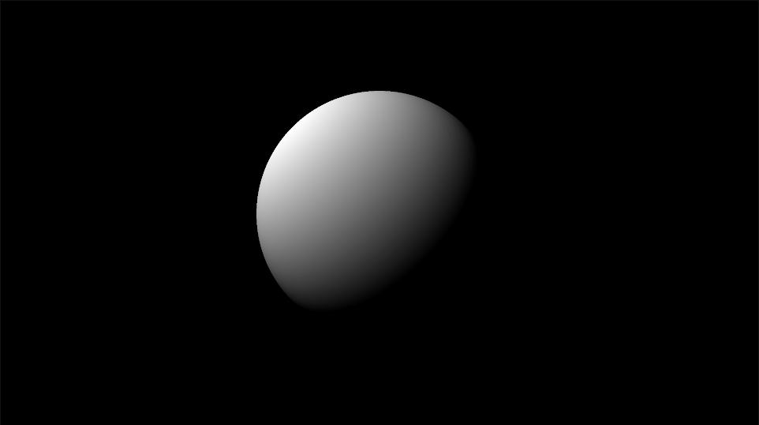
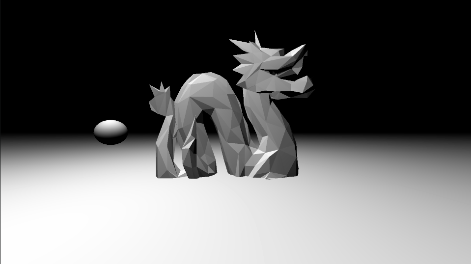
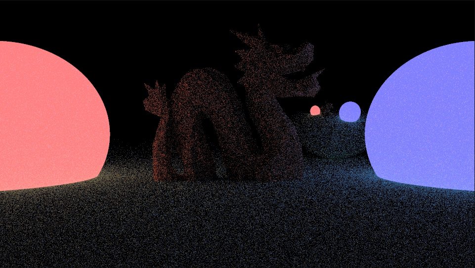
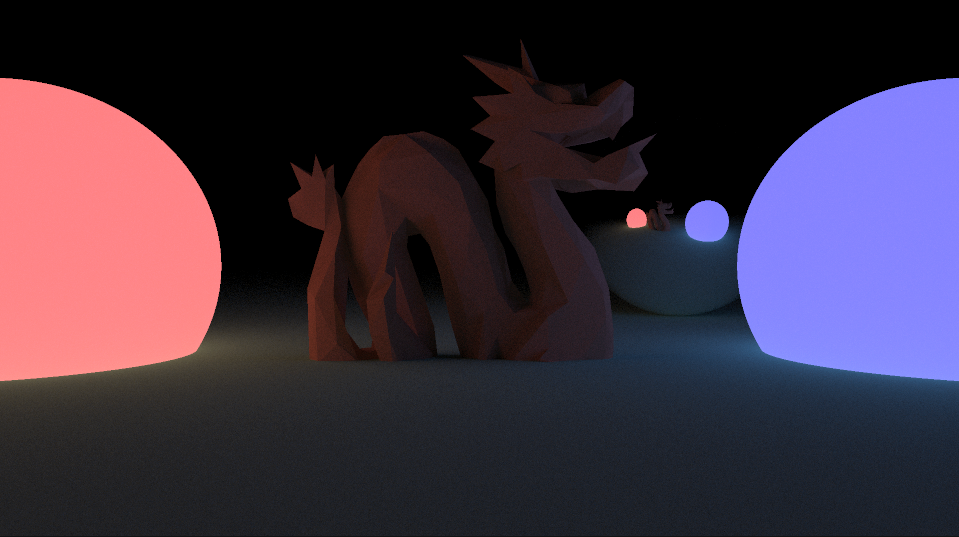
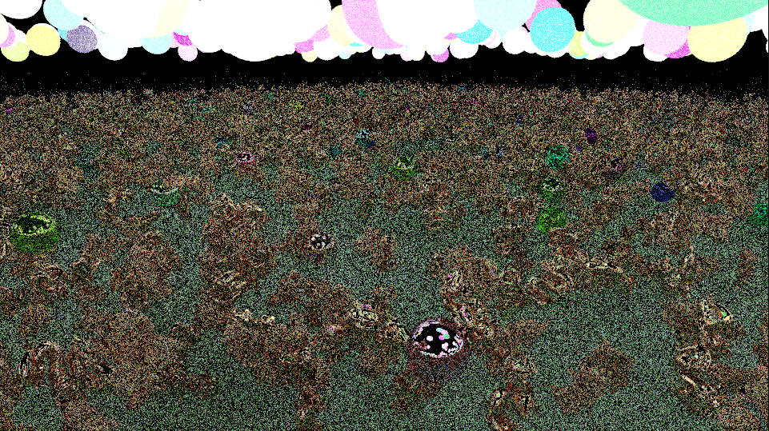
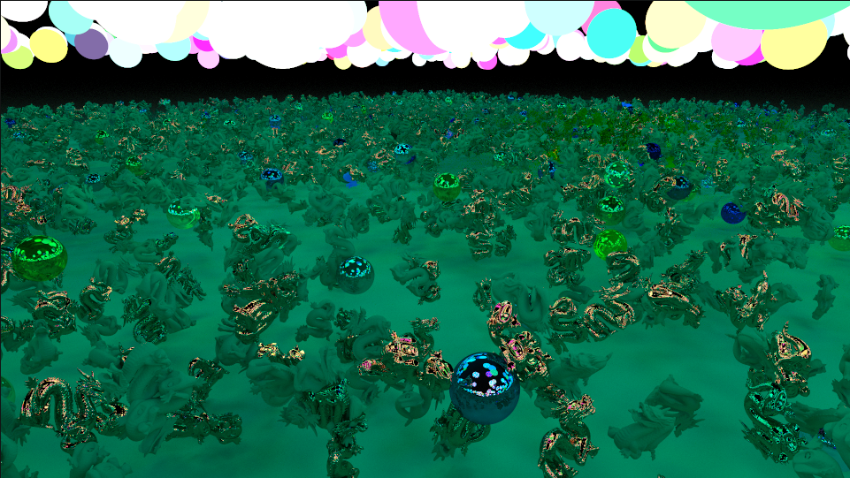
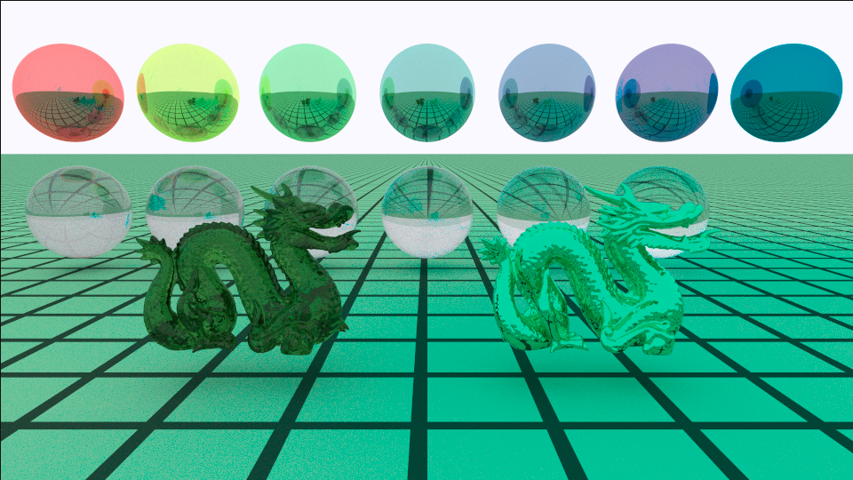
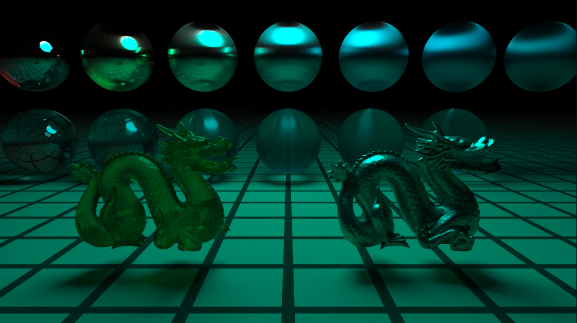

# 基于 C++17 的高性能 CPU 路径追踪渲染引擎

## 核心摘要

本项目是一个从零手写的基于 CPU 的物理级光线追踪（Path Tracing）渲染器。项目采用 C++17 标准，脱离繁重的图形 API，仅依赖 `glm` 进行数学计算和 `rapidobj` 进行模型加载。通过历经 13 个大版本的迭代，项目实现了从单线程光线投射到多线程、SAH-BVH 加速、俄罗斯轮盘赌、多态材质系统以及复杂大场景渲染的完整路径追踪架构。

---
## 最终效果


 

 

 

 






---

# 项目笔记
## Camera

这个 `camera` 文件夹构成了渲染器中**“眼睛”**和**“视神经”**的部分。它主要包含光线定义、相机模型以及胶片（底片）。相机负责向场景中发射光线（Primary Ray），光线去场景中收集颜色，最后将结果绘制到胶片上。

---

###  `Ray` 与 `HitInfo` 

这两个数据结构是整个光线追踪算法的“血液”，在所有的求交、着色代码中都会不断传递。

####  `HitInfo` 结构体
*   **功能**：记录光线与场景中物体相交时的各项物理/几何信息。
*   **成员变量**：
    *   `float t`：相交时的参数 $t$（即光线从起点走到交点走过的距离/时间）。
    *   `glm::vec3 hit_point`：交点在世界空间中的绝对坐标 $(x, y, z)$。
    *   `glm::vec3 normal`：交点处的表面几何法线。
    *   `const Material *material`：指向交点所属物体材质的指针，用于后续计算 BRDF 和着色。

#### `Ray` 结构体 (`ray.hpp` / `ray.cpp`)
*   **功能**：定义一条在三维空间中传播的光线。
*   **成员变量**：
    *   `glm::vec3 origin`：光线的起点坐标。
    *   `glm::vec3 direction`：光线的传播方向（通常要求归一化）。
    *   `bounds_test_count` / `triangle_test_count`（被 `DEBUG_LINE` 宏包裹，使用 `mutable` 修饰）：**调试专用字段**。用于统计这条光线在 BVH 遍历过程中，究竟和多少个包围盒/三角形进行了求交测试。`mutable` 允许即使在传入 `const Ray&` 的情况下依然能修改这俩变量。
*   **成员函数实现细节**：
    *   **`glm::vec3 hit(float t) const`**：
        *   **功能**：利用光线的参数方程计算确切坐标。
        *   **实现**：直接返回 $Origin + t \times Direction$。
    *   **`Ray objectFromWorld(const glm::mat4 object_from_world) const`**：
        *   ==**功能**：将光线从世界坐标系转换到局部（物体）坐标系。这在处理物体自身的缩放、旋转、平移（Transform）时非常有用，因为**把光线变进局部空间求交，比把复杂模型变到世界空间求交要快得多且简单**。==   坐标空间变换：https://www.cnblogs.com/fortunely/p/18709389   ✨ 留坑：变换矩阵object_from_world从哪里来？——SceneBVH场景定义每个物体的位置、旋转、缩放。ShapeInstance保存了world_from_object和object_from_world的逆矩阵。
        *   **实现细节**：
            1.  将光线起点 `origin` 补全为齐次坐标 `glm::vec4(origin, 1.f)`。**点（Point）的齐次坐标 $w=1$**，这样矩阵乘法会对其应用平移。
            2.  将光线方向 `direction` 补全为齐次坐标 `glm::vec4(direction, 0.f)`。**向量（Vector）的齐次坐标 $w=0$**，这样矩阵乘法只会旋转和缩放它，而不会平移（因为方向没有位置的概念）。
            3.  分别乘以变换矩阵，构造一条新的射线并返回。

---

###  `camera.hpp` / `camera.cpp`

相机类是光线追踪起点的核心，它模拟了真实世界的针孔相机，主要负责**坐标空间的逆向转换**（屏幕像素 $\rightarrow$ NDC $\rightarrow$ 裁剪空间 $\rightarrow$ 相机空间 $\rightarrow$ 世界空间）。

- 正向的 MVP 是 **M · V · P**，用于把模型顶点送入裁剪空间。

- 光线生成不需要模型空间（光线是从相机发出，而不是从某个物体发出），因此 **不需要 M 矩阵**。

- 它的核心是 **利用 VP 的逆变换**：

  $$\mathrm{WorldPoint} = V^{-1} \cdot P^{-1} \cdot \mathrm{ClipPoint}$$

  再结合相机位置，得到从相机出发穿过该像素的世界空间光线。

**一句话总结**：
`generateRay` 没有使用完整的 MVP，而是沿用了传统管线的 **V·P 矩阵的逆变换**，把屏幕像素反推到世界空间的光线方向。这条通路正好与“世界→相机→裁剪→NDC→屏幕”的流水线完全对称，只是方向相反。在 `generateRay` 的代码中，**没有直接进行透视除法**。正向渲染管线中，透视除法是 **Clip Space → NDC** 这一步（除以 w），而 `generateRay` 是 **逆向过程**：它从 NDC 直接构造了一个 `w=1` 的裁剪点 `clip {ndc, 0, 1}`，这等价于**假设已经完成了透视除法**，再通过逆投影矩阵还原回相机空间。因此，透视除法的效果被隐含在反向构造里，但没有显式的除法操作

#### 类的成员变量
*   `Film &film`：相机绑定的胶片引用。相机要知道画布有多大，并且后续生成的颜色要写回这里。
*   `glm::vec3 pos`：相机在世界空间中的位置（即人眼的位置 / 针孔位置）。
*   `glm::mat4 camera_from_clip`：**从裁剪空间到相机空间**的逆投影矩阵。
*   `glm::mat4 world_from_camera`：**从相机空间到世界空间**的逆视图矩阵。

#### 成员函数实现细节
##### 构造函数
```cpp
Camera::Camera(Film& film, const glm::vec3 & pos, const glm::vec3& viewpoint, float fovy)
```
*   **功能**：初始化相机参数，预计算极其重要的“逆矩阵”。
*   **实现细节**：
    1.  **计算 `camera_from_clip`**：传统光栅化（OpenGL）是把相机空间变到裁剪空间，用的是透视投影矩阵 `glm::perspective`。这里传入 FOV（视角，并转为弧度）、宽高比、近平面(1.0)、远平面(2.0)。但在光线追踪里我们要反着来（从屏幕射出光线），所以用 **`glm::inverse()`** 求其逆矩阵。
    2.  **计算 `world_from_camera`**：同样地，传统 View 矩阵用 `glm::lookAt`（传入相机位置 `pos`，观察点 `viewpoint`，上向量 `(0,1,0)`）把世界空间变到相机空间。这里也求逆 **`glm::inverse()`**，以便后续把光线从相机发射到世界中。

##### `generateRay` (生成相机光线 - 重点核心)
```cpp
Ray generateRay(const glm::ivec2& pixel_coord, const glm::vec2& offset) const
```
*   **功能**：==给定屏幕上的一个像素坐标 $(x, y)$（加上一个用于抗锯齿/随机采样的亚像素偏移量 `offset`），返回一根射向该像素对应的世界坐标方向的射线。==
*   **实现细节分解（数学空间转换过程）**： 坐标空间变换：https://www.cnblogs.com/fortunely/p/18709389   ✨ 
    1.  **像素空间 $\rightarrow$ [0, 1] 空间**：`ndc = (pixel + offset) / 分辨率`。  +offset(0.5,0.5): 像素中心
    2.  **Y轴翻转**：`ndc.y = 1.f - ndc.y`。因为在图片/屏幕坐标系中，Y轴是向下的（左上角是0,0）；而在 NDC（标准化设备坐标）中，Y轴是向上的，所以要翻转。
    3.  **[0, 1] $\rightarrow$ NDC [-1, 1]**：`ndc = 2.f * ndc - 1.f`。将值域拉伸到 -1 到 1 的正方体区间。
    4.  **构建裁剪空间坐标 (Clip Space)**：`glm::vec4 clip {ndc, 0, 1}`。在此处 $Z=0$ 对应着投影近平面的位置，$W=1$ 表示这是一个点。
    5.  **逆向连乘，变回世界坐标**：`world = world_from_camera * camera_from_clip * clip`。通过连续乘以两个预先算好的逆矩阵，将 NDC 上平面的点转换成了世界空间中的真实三维坐标 `world`。
    6.  **构造 Ray**：起点固定为相机位置 `pos`，方向是目标点减去起点并归一化 `glm::normalize(world - pos)`。返回这条组装好的光线。

##### `getFilm()` (获取胶片)
*   **实现**：提供普通的 `Film &getFilm()` 和常函数版本 `const Film &getFilm() const`，直接返回绑定的 film 引用。

---

### `film.hpp` / `film.cpp`

（简要而完整地复盘其所有函数，作为输出模块）

####  `Pixel` 结构体

这是构成胶片的最小单元，代表图像上的一个像素。

```cpp
struct Pixel{
    glm::vec3 color{0, 0, 0};   // 每个像素的颜色
    int sample_count {0};       // 记录每个像素有多少个采样点
};
```

*   **`color` (glm::vec3)**：存储该像素累加的颜色值。在光线追踪中，由于会进行多次采样（蒙特卡洛积分），这里存储的是**所有采样点颜色的总和**，通常是浮点数（HDR，高动态范围）。
*   **`sample_count` (int)**：记录当前像素已经接收了多少条光线（采样）的打击。这个变量非常重要，用于在最终输出图片时求取平均颜色。

####  `Film` 成员变量
*   **`size_t width, height`**：记录胶片（最终图像）的宽度和高度（分辨率）。
*   **`std::vector<Pixel> pixels`**：使用一维数组来模拟二维图像的像素网格。一维数组在内存中是连续的，比二维数组（`vector<vector>`）具有更好的缓存命中率（Cache Friendly），能显著提升性能。二维坐标 `(x, y)` 映射到一维的公式是：`index = y * width + x`。

####  成员函数实现细节
*   **`Film(size_t width, size_t height)` (构造)**：初始化宽高，调用 `pixels.resize()` 分配内存，全部像素默认黑底、0采样。
*   **`Getter`**: `getWidth()`, `getHeight()`, `getPixel(x,y)` (按 `y * width + x` 取出对应像素值)。
* ==`addSample` (添加采样 - 核心渲染接口)==

  ```cpp
  void addSample(size_t x, size_t y, const glm::vec3 &color){
      pixels[y * width + x].color += color;
      pixels[y * width + x].sample_count++;
  }
  ```

  *   **功能**：将一条光线追踪计算得到的颜色结果写入到底片上。
  *   **实现细节**：
      1.  通过 `y * width + x` 找到对应像素。
      2.  将传入的 `color` **累加**（`+=`）到该像素已有的颜色上。
      3.  将该像素的采样计数器 `sample_count` 自增 1。
*   **`clear()`**：调用 `vector::clear()` 并重新 `resize`，快速清空整个画布状态以备下一次渲染。先调用 `clear()` 清空 vector 中的所有元素（size变为0），紧接着调用 `resize()` 重新分配空间。因为 `Pixel` 有默认构造，这样等同于将所有像素颜色归零，采样数清零。
*   ==`save` (保存图片 - 核心 I/O 与多线程处理)==
    
    ```cpp
    void Film::save(const std::filesystem::path &filename)
    ```
    
    这是全类中最复杂的函数，负责将内存中的浮点数颜色数据转换并持久化为本地图片文件。
    
    * **实现细节分解**：
    
      1. **打开文件**：
    
         ```cpp
         std::ofstream file(filename, std::ios::binary);
         ```
    
         以**二进制模式**（`std::ios::binary`）打开或创建文件。这是因为接下来要写入的是 P6 格式的 PPM 文件。
    
      2. **写入 PPM 文件头**：
    
         ```cpp
         file << "P6\n" << width << ' ' << height << "\n255\n";
         ```
    
         *   `P6` 标识这是一个二进制的 RGB 图像格式（注释提到的 P3 是纯文本 ASCII 格式）。
         *   写入 `宽 高`。
         *   `255` 表示颜色的最大值（单通道8-bit）。
    
      3. **准备像素缓冲区**：
    
         ```cpp
         std::vector<uint8_t> buffer(width * height * 3);
         ```
    
         创建一个 `uint8_t` (相当于 `unsigned char`，占 1 Byte) 的一维数组。因为每个像素有 R, G, B 三个通道，所以大小是 `像素总数 * 3`。
    
      4. **多线程计算像素颜色（Tone Mapping / 转换）**：
    
         ```cpp
         thread_pool.parallelFor(width, height, [&](size_t x, size_t y){ ... }, false);
         ```
    
         这里调用了外部的线程池 `thread_pool` 进行并发处理，遍历所有 `(x,y)` 坐标。Lambda表达式内部处理逻辑如下：
    
         *   `auto pixel = getPixel(x, y);` 获取 ==包含累加颜色和采样次数的像素==。
         *   `pixel.color / static_cast<float>(pixel.sample_count)`：**求平均颜色**。因为之前是累加的，这里 ==除以采样次数得到真实的平均色==。
         *   `RGB rgb(...)`：调用外部工具类 `RGB`，将浮点数颜色（通常是 0.0~1.0 甚至大于1的 HDR 颜色）转换为 `0-255` 的 8-bit RGB 整型值（可能包含伽马校正等逻辑，具体取决于 `RGB` 类的实现）。
         *   `auto idx = (y * width + x) * 3;`：计算当前像素 R 通道在 buffer 中的起始一维索引。
         *   依次将 `rgb.r`, `rgb.g`, `rgb.b` 写入 buffer 的 `idx`, `idx+1`, `idx+2` 位置。
    
      5. **线程同步与数据写入**：
    
         ```cpp
         thread_pool.wait();
         file.write(reinterpret_cast<const char*>(buffer.data()), buffer.size());
         ```
    
         *   调用 `wait()` 阻塞主线程，**确保所有的多线程任务都已经计算完毕**，此时 `buffer` 已被完全填充。
         *   调用 `file.write` 将整个 `buffer` 内存块中的二进制数据一次性写入到磁盘文件中。`reinterpret_cast` 是因为 `write` 函数需要 `const char*` 类型的指针。

---

### 💡 复习总结

FILM：

1.  **一维数组降维打击**：使用 1D `vector` 配合 `y * width + x` 公式替代 2D 数组，这体现了对内存连续性和 Cache Friendly 的考虑。
2.  **蒙特卡洛积分思想**：`addSample` 并不是直接覆盖颜色，而是 `+= color` 然后 `count++`，最后在 `save` 时除以 `count` 求平均。在工程上完美映射了蒙特卡洛方法中“多次采样求均值以逼近真实积分值”的数学思想。
3.  **多线程优化**：在最后生成图像数据写入 buffer 的阶段，并没有使用串行 `for` 循环，而是结合 `thread_pool.parallelFor` 并发计算像素的转换，极大提升了图像后处理输出的速度。
4.  **PPM 文件格式**：理解 P6 (二进制) 和 P3 (ASCII) 的区别，以及 PPM 的 Header 结构（Magic Number, 宽高, Max Color）。

RAY / CAMERA:

1.  **“逆向”思维（Camera）**：一定要清楚光栅化（正向：模型$\rightarrow$世界$\rightarrow$相机$\rightarrow$裁剪$\rightarrow$屏幕）和光线追踪（逆向：屏幕像素$\rightarrow$反求世界坐标系交点方向）的区别，这是 `camera_from_clip` 等**逆矩阵**存在的核心原因。
2.  **齐次坐标的物理意义（Ray）**：在 `objectFromWorld` 中，把位移（点，w=1）和方向（向量，w=0）进行区分并分别做矩阵乘法，是必须掌握的图形学常识。==为什么这样设计（为什么要把光线从世界空间转换到物体空间）？==
    - **简化求交计算**
      标准几何体（球、平面、盒子等）在它们自己的局部坐标系中都有极其简单的方程（球心在原点、半径为 1 的单位球；盒子是轴对齐的 `[-1,1]³` 等）。将光线变换到该空间后，求交计算就变成了最简单的形式，不需要在每次碰撞检测时考虑复杂的旋转和平移。
    - **保持物体模型的可重用性**
      比如场景里有很多相同形状的物体（不同的位置、旋转、缩放），只需保存一个“原型”模型，然后用不同的世界变换矩阵来摆放它们。求交时，**将光线反变换到每个物体的局部空间**，就可以共用同一套求交代码。
    - **分离几何与坐标变换**
      ==这样使渲染器架构更清晰：Scene 负责管理物体和它们的变换矩阵，求交函数只需要专注于几何体的局部形状，无需关心物体在世界中的位置。==
    - **变换法线等其他信息**
      当光线在局部空间中击中物体后，得到的交点、法线等数据需要重新变换回世界空间（通常用法线逆矩阵），以计算正确的光照。

---


## Util

这个 `util` 文件夹包含了光线追踪/渲染器项目中非常关键的**底层工具类**。它们虽然不直接参与光线求交，但为整个渲染系统提供了数学坐标系转换、性能测试、多线程进度管理、颜色处理和随机数生成等基础设施。

---

### `debug_macro.hpp` 
*   **功能**：提供条件编译的调试代码支持。
*   **实现细节**：
    *   **`DEBUG_LINE(...)`**：如果定义了 `WITH_DEBUG_INFO` 宏，它会将括号内的代码原封不动地展开并加上分号执行；如果没有定义，这个宏就是空的，代码在编译时会被完全抹除，不会影响 Release 版本的性能（0开销）。

---

###  `frame.hpp` / `frame.cpp`)
*   **类功能**：构建**局部着色坐标系（TBN矩阵的变种）**。在光线追踪计算BRDF（材质反射）时，通常假设法线垂直向上（Y轴或Z轴）。`Frame` 负责以法线为基础，在三维世界中构建出一套互相垂直的局部 X、Y、Z 轴，并提供世界空间与局部空间方向向量的相互转换。
*   **成员变量**：`x_axis, y_axis, z_axis` (局部坐标系的三个正交基向量，存储在世界坐标系下的方向)。 ==右手系==
*   **函数实现细节**：
    *   **`Frame(const glm::vec3 &normal)` (构造函数)**：
        1. 传入==世界空间的法线 `normal`==，直接将其 ==作为局部的 `y_axis`==。
        2. 为了求出 `x_axis` 和 `z_axis`，需要找一个辅助向量 `up`。
        3. **奇异点处理**：如果法线几乎平行于世界Y轴（`abs(normal.y) > 0.99999`），使用世界Z轴 `(0,0,1)` 作为辅助向量；否则使用世界Y轴 `(0,1,0)`。这防止了叉乘时产生零向量。
        4. 将 `up` 与 `y_axis` 叉乘得到 `x_axis` 并归一化。
        5. 将 `x_axis` 与 `y_axis` 叉乘得到 `z_axis` 并归一化。至此正交基建立完毕。
    *   **`localFromWorld(const glm::vec3 &direction_world)`**：
        *   **功能**：世界方向 -> 局部方向。
        *   **实现**：==利用**点乘（投影）**==。将世界向量分别投影到局部的X、Y、Z轴上（即分别与三个轴做点乘），得到的结果就是局部空间下的 (x, y, z) 坐标，最后再次归一化防止浮点误差。
    *   **`worldFromLocal(const glm::vec3 &direction_local)`**：
        *   **功能**：局部方向 -> 世界方向。
        *   **实现**：利用**基向量的线性组合**。将局部坐标的 x, y, z 分别乘以对应的世界空间基向量 `x_axis, y_axis, z_axis` 并相加。最后归一化。

---

###  `profile.hpp` / `profile.cpp`

==亮点：c++11 `std::chrono`==

*   **类功能**：利用 **RAII（资源获取即初始化）机制** 实现自动测量代码块执行时间的性能分析工具。
*   **成员变量**：`name` (测试块的名称), `start` (高精度时间点，记录开始时间)。
*   **函数实现细节**：
    *   **`PROFILE(name)` (宏)**：通过实例化一个 `Profile` 局部对象来启动计时。
    *   **`Profile(const std::string &name)` (构造函数)**：记录传入的名称，并调用 `std::chrono::high_resolution_clock::now()` 获取当前精确时间作为起点。
    *   **`~Profile()` (析构函数)**：当离开作用域（如函数结束）时自动触发。获取当前时间，减去 `start` 得到 `duration`，并将其转换为毫秒（`milliseconds`），最后 `std::cout` 打印出耗时。

---

###  `progress.hpp` / `progress.cpp`
*   **类功能**：一个**线程安全**的渲染进度条。由于渲染是多线程并发的，多个线程可能同时完成像素渲染并试图更新进度，因此必须加锁。
*   **成员变量**：`total`(总任务数), `current`(当前已完成), `percent`(当前百分比), `last_percent`(上一次打印的百分比), `step`(每隔百分之几打印一次), `spin_lock`(自旋锁)。
*   **函数实现细节**：
    *   **`Progress(size_t total, size_t step = 1)` (构造函数)**：初始化总任务量和打印步长（默认1%打印一次），并将初始百分比等清零，控制台输出 `0%`。
    *   **`void update(size_t count)`**：
        1. **线程同步**：首行调用 `Guard guard(spin_lock);` 获取自旋锁。这保证了同一时刻只有一个线程可以修改进度，避免了数据竞争（Data Race）。
        2. `current += count` 累加完成的任务数。
        3. 计算最新百分比 `percent = 100 * current / total`。
        4. 判断 `percent - last_percent >= step` 或到达 `100%` 时，更新 `last_percent` 并在控制台打印进度。离开函数作用域时 `guard` 会自动解锁。

---

###  `rgb.hpp`
*   **类功能**：负责处理 ==**显示颜色（0-255 整型）**与**物理光照强度（浮点向量）**之间的转换==，其中包含了非常关键的  ==**Gamma 校正 (Gamma Correction) **==逻辑；同时提供 ==伪彩热力图== 生成。
*   **成员变量**：`int r, g, b` (存储 0-255 的颜色分量)。
*   **函数实现细节**：
    *   **`Lerp(const RGB &a, const RGB &b, float t)` (全局内联函数)**：
        *   对颜色 a 和 b 的三个通道分别进行线性插值：`a + (b - a) * t`。使用 `glm::clamp` 确保结果始终在 [0, 255] 之间。
    *   **`GenerateHeatmapRGB(float t)` (静态方法)**：
        *   传入一个 [0, 1] 之间的浮点数（通常代表某种权重或深度），返回一个热力图颜色。
        *   内部定义了一个具有25种颜色的调色盘数组（颜色渐变序列）（`color_pallet`，类似 Viridis 色带）。
        *   将 `t * 数组大小` 得到浮点索引 `idx_float`。
        *   向下取整 `glm::floor` 得到数组下标 `idx`。
        *   使用 `glm::fract` 获取小数部分作为插值权重，调用 `Lerp` 在相邻两个调色盘颜色之间进行平滑过渡。
    *   **`RGB(int r, int g, int b)` (普通构造)**：简单赋值。
    *   **`RGB(const glm::vec3 &color)` (物理转显示 - 包含 Gamma 校正)**：
        *   输入的是渲染器计算出的线性物理光强度。
        *   **实现**：对每个通道取 `1.0 / 2.2` 次幂进行 **Gamma 校正**（因为显示器会有2.2次幂的压暗效应，这里提前提亮）。然后乘以 255 转为 8-bit 整型，并用 `glm::clamp` 截断超出的高光部分。
    *   **`operator glm::vec3() const` (显示转物理 - 类型转换运算符)**：
        *   允许将 `RGB` 对象隐式转换为 `glm::vec3`。
        *   **实现**：除以 255 归一化到 [0, 1]，然后取 `2.2` 次幂进行 **Gamma 逆校正（Linearization）**，还原为线性空间的光照强度。

---

###  `rng.hpp`
*   **类功能**：随机数生成器（Random Number Generator）。==光线追踪中到处都需要随机数（如蒙特卡洛积分的采样）==，此类包装了 C++11 的随机数引擎。
*   **成员变量**：
    *   `mutable std::mt19937 gen` (梅森旋转算法引擎，生成伪随机数)。
    *   `mutable std::uniform_real_distribution<float> uniform_distribution` (均匀分布，范围定死为 [0, 1])。
    *   *(注：使用 `mutable` 是因为生成随机数会改变引擎内部状态，但我们在语义上希望生成随机数这个操作对外部调用者来说是 `const` 的。)*
*   **函数实现细节**：
    *   **`RNG(size_t seed)`**：带种子的构造函数，调用 `setSeed` 初始化状态。
    *   **`RNG()`**：默认构造函数，委托调用 `RNG(0)`，默认种子为0。
    *   **`setSeed(size_t seed)`**：重新设置随机数引擎的种子 `gen.seed(seed)`。不同的线程或者不同的像素通常需要不同的种子以避免图案重复（Artifacts）。
    *   **`uniform() const`**：
        *   调用分布器 `uniform_distribution(gen)`，返回一个

---


## Thread

这个 `Thread` 文件夹是整个渲染器实现**多线程并发加速**的核心模块。在光线追踪中，每个像素的计算通常是相互独立的，因此非常适合用多线程进行加速。

为了兼顾高性能和低开销，作者没有直接使用 C++ 标准库中的 `std::mutex`，而是自己实现了一套**轻量级自旋锁**，并手写了一个**线程池（Thread Pool）**。

---

### `spin_lock.hpp`

在多线程中，向队列添加任务或获取任务时会存在资源竞争。==标准库的 `std::mutex` 在获取不到锁时会让线程进入内核态休眠，上下文切换开销较大。对于极其短暂的锁争用，**自旋锁（SpinLock）** 性能更好==。

#### 1. `SpinLock` (自旋锁类)

*   **功能**：提供基于原子操作的非阻塞式锁。
*   **成员变量**：`std::atomic_flag flag {}`，这是一个无锁的原子布尔标志位，专门用于实现底层并发。
*   **函数实现细节**：
    *   **`acquire()` (加锁)**：使用一个 `while` 循环不断调用 `flag.test_and_set(std::memory_order_acquire)`。如果锁已经被别人拿走（返回 true），当前线程不会休眠，而是调用 `std::this_thread::yield()` 主动让出 CPU 时间片，然后继续循环尝试获取，直到成功拿到锁（返回 false 并将其设为 true）。
    *   **`release()` (解锁)**：调用 `flag.clear(std::memory_order_release)` 将标志位清空，允许其他自旋等待的线程获取锁。

#### 2. `Guard` (RAII 锁包装器)

*   **功能**：利用 C++ 的 RAII 机制，确保自旋锁在作用域结束时一定会被释放，防止死锁（相当于标准库的 `std::lock_guard`）。
*   **函数实现细节**：
    *   **`Guard(SpinLock &spin_lock)` (构造)**：保存传入的自旋锁引用，并立即调用 `spin_lock.acquire()` 上锁。
    *   **`~Guard()` (析构)**：离开作用域时自动调用，执行 `spin_lock.release()` 解锁。

---

### `thread_pool.hpp / .cpp`

这里定义了任务的基类以及管理所有工作线程的线程池类。文件中还声明了一个全局单例：`extern ThreadPool thread_pool;` 供整个项目使用。

#### 1. `Task` 
*   **功能**：一个纯虚基类，代表一个可以被线程执行的任务。
*   **函数实现**：包含纯虚函数 `virtual void run() = 0;` 要求子类必须实现具体逻辑，以及虚析构函数（确保通过基类指针释放内存时不会内存泄漏）。

#### 2. `ParallelForTask`
*   **功能**：继承自 `Task`，专门用于处理图像中**某一个区块（Chunk）**的像素遍历任务。
*   **函数实现细节**：
    *   **构造函数**：接收区块的起点坐标 `(x, y)`、区块的宽高 `(chunk_width, chunk_height)`，以及要执行的匿名函数 `lambda`。
    *   **`run()`**：两层普通的 `for` 循环，遍历当前分配到的 `[chunk_width * chunk_height]` 范围内的所有像素，并依次调用 `lambda(x + idx_x, y + idx_y)` 执行真正的渲染逻辑。

#### 3. `ThreadPool` 

负责预先创建好一批线程，避免了频繁创建和销毁线程的巨大开销。

*   **成员变量**：
    *   `alive (std::atomic<int>)`：控制线程池生命周期的标志，1 表示存活，0 表示准备销毁。
    *   `threads (std::vector<std::thread>)`：存储所有预先创建好的物理工作线程。
    *   `pending_task_count (std::atomic<int>)`：==**非常关键**，记录当前尚未执行完毕的任务总数（包括队列里的和正在执行的）== 项目遇到的问题可以讲。
    *   `tasks (std::queue<Task *>)`：任务队列。
    *   `spin_lock (SpinLock)`：用于保护 `tasks` 队列读写安全的自旋锁。

*   **成员函数实现细节**：

    *   **`ThreadPool(size_t thread_count)` (构造函数)**：
        1. 初始化 `alive = 1`，`pending_task_count = 0`。
        2. 如果传入的线程数是 0，则调用 `std::thread::hardware_concurrency()` 获取当前电脑的 CPU 逻辑核心数（最大化利用多核）。
        3. 循环 `thread_count` 次，创建线程并绑定静态成员函数 `WorkerThread`，将 `this` 指针传给它。

    *   **`~ThreadPool()` (析构函数)**：
        1. 先调用 `wait()`，阻塞等待所有积压的任务全部彻底执行完毕。
        2. 将 `alive` 设为 0，通知所有循环中的工作线程退出。
        3. 遍历 `threads` 数组，依次调用 `thread.join()`，主线程等待所有子线程安全结束。
        4. 最后 `threads.clear()` 清空数组。

    *   **`static void WorkerThread(ThreadPool* master)` (工作线程执行体)**：
        这是每个线程诞生后一直在跑的死循环函数。
        1. `while(master->alive == 1)` 判断线程池是否还要继续工作。
        2. 检查 `tasks` 是否为空。==**优化点**：如果队列为空，调用 `sleep_for(2ms)` 让线程休眠 2 毫秒。这避免了线程在无任务时空转疯狂消耗 CPU 资源（100%占用）。
        3. 如果有任务，调用 `getTask()` 取出任务。
        4. 执行 `task->run()`，然后 `delete task` 释放内存，最后将 `pending_task_count--`（表示彻底完工了一个任务）。
        5. ==如果取任务失败（`task == nullptr`），使用 `yield()` 让出 CPU 控制权==。

    *   **`addTask(Task *task)` / `getTask()`**：
        标准的生产者-消费者基础操作。
        1. 都通过 `Guard guard(spin_lock);` 上锁，保证入队和出队时的线程安全。
        2. `addTask` 在 push 之前会将 `pending_task_count++`。
        3. `getTask` 取出 `front` 然后 `pop` 返回；若为空则返回 `nullptr`。

    *   **`parallelFor(...)` (并行遍历 - 核心调度函数)**：
        ==将一张大图片拆分成若干个小块，包装成一个个 `ParallelForTask` 扔进线程池。==
        
        1. `Guard` 加锁防止数据竞争。
        2. ==**计算区块大小 (Chunk Size)**：为了让任务均匀分给每个线程，将图像宽和高分别除以 `sqrt(线程数)`。==
        3. ==**负载均衡优化 (`complex` 参数)**==：如果当前渲染场景很复杂（比如开启了 BVH 和全局光照），有些区块（比如空白天空）算得快，有些（比如玻璃折射）算得极慢。此时如果每个线程只分到一个大块，会导致某些线程早早完工而另一些线程卡死（即所谓的长尾效应）。
           *解决办法*：如果 `complex == true`，将宽高再除以 `sqrt(16)`（即长宽各分成4份，总共多出16倍的碎块）。把大任务打散成更多的小任务，能让先空闲下来的线程去帮没算完的线程分担工作。
           - **简单任务**：每个像素的工作量很小，且大致均匀（比如简单的图像处理、直接写入固定颜色）。此时分块较大。块数约等于线程数 `n`，每个线程执行 1 个或少数几个任务，**调度开销最小**。
           
           - **复杂任务**：每个像素的工作量可能很大（如光线追踪深层递归），或不同像素之间计算量差异显著（如某些区域击中复杂模型，某些区域直接射向天空）。这时分块再缩小 4×4 倍：块数变为原来的 16 倍（约 `16n`），每个任务的像素数大幅减少。
           
        4. 利用双层 `for` 循环（按照区块长宽步进）遍历整张图片。
        5. **边界截断处理**：如果 `x + chunk_width > width`，说明到达图片边缘，需要缩小当前区块的 `chunk_width` 刚好贴合边界（同理处理 height）。
        6. `pending_task_count++`，然后 `new ParallelForTask` 并推入队列。
        
    *   **`wait() const` (等待所有任务完成)**：
        主线程调用的同步卡点，用于在保存图像之前确保所有像素都已渲染完毕。
        
        1. 原版实现是判断 `!tasks.empty()`，但作者修正了这个 **Bug**：因为任务被 `getTask()` 拿走后队列就空了，但此时线程还在执行 `run()` 并没有算完，如果这时候退出会导致渲染不完整。
        2. **正确实现**：使用一个 `while (pending_task_count > 0)` 循环。只有当所有任务不仅出了队列，而且 `run()` 彻底跑完（触发 `pending_task_count--`），总数归零时，`wait` 才会结束。
        3. 循环内部同样使用 `yield()` 避免主线程空转。

---

### 💡 复习总结

Thread:

1.  **无锁并发思维**：用 `std::atomic_flag` 手写自旋锁，并结合 RAII 思想封装 `Guard`，展示了对底层并发同步机制的掌握。这个线程池选择**自旋锁**，而不是标准库的 `std::mutex`，核心原因是**任务队列的操作非常短，上下文切换的代价远大于自旋等待**。如果使用 `std::mutex`，一旦锁被占用，线程就会被系统挂起，涉及内核态切换和调度，**开销时常比执行临界区本身还要大**。而自旋锁只是用原子操作反复检查，能立即获得锁时几乎没有额外代价，非常符合“锁持有时间极短”的场景。
2.  **`pending_task_count (std::atomic<int>)` 的精妙作用**：完美解决了“队列空不等于任务做完”的经典并发同步 Bug，保证 `wait()` 逻辑的绝对正确。
3.  **负载均衡 (Load Balancing) 策略**：`parallelFor` 中通过 `complex` 参数将大任务切成更多小块放入队列，防止复杂场景下多线程工作量不均（长尾效应）。
4.  **CPU 节能优化**：在工作线程拿不到任务时，没有使用狂暴的 `while(true)` 空转，而是优雅地加入了 `sleep_for(2ms)` 和 `yield()` 减少 CPU 不必要的满载。在未能获得锁时主动调用 `yield()`，把 CPU 时间片让给其他线程，既避免了纯粹的“忙等”浪费，又没有陷入内核级睡眠的沉重开销。这是一种 **轻量级混合自旋**，很适合这种等待时间短但不确定的场合。

---


## Accelerate

这个 `accelerate` 文件夹是光线追踪器中**极其核心的性能优化模块**，实现了**层次包围盒（BVH, Bounding Volume Hierarchy）**。如果没有 BVH，光线需要和场景中的每一个三角形进行求交测试，渲染速度会慢到无法忍受。通过建立空间索引结构，BVH 将求交的时间复杂度从 $O(N)$ 降到了 $O(\log N)$。

在这个项目中，作者采用了工业界常用的**两级 BVH 架构**（类似 OptiX / Vulkan Ray Tracing）：
1.  **底层 BVH (BLAS, 对应 `bvh.hpp`)**：针对单个复杂模型（例如由成千上万个三角形组成的兔子模型）构建的三角形层次树。
2.  **顶层 BVH (TLAS, 对应 `scene_bvh.hpp`)**：针对整个场景构建的实例层次树（包含物体的空间变换、材质等）。

下面为你详细剖析这部分的核心实现细节，绝不遗漏任何一个函数。

---

### `bounds.hpp` / `bounds.cpp` 

*   **功能**：定义三维空间中的轴对齐包围盒（Axis-Aligned Bounding Box, AABB），提供基础的空间描述和快速的“光线-包围盒”求交算法（基于 Slab 方法）。
*   **成员变量**：`b_min`, `b_max`（分别表示包围盒最小角和最大角的 3D 坐标）。

*   **函数实现细节**：
    *   **`Bounds()` (默认构造)**：==初始化为一个退化的包围盒==（`b_min` 为正无穷，`b_max` 为负无穷）。这样在后续执行 `expand` 时，任何点都能瞬间将其覆盖。
    *   **`Bounds(b_min, b_max)` (含参构造)**：直接赋值。
    *   **`expand(const glm::vec3 &pos)` (加入点)**：利用 `glm::min` 和 `glm::max`，更新包围盒边界，使其刚好能包容传入的三维点 `pos`。
    *   **`expand(const Bounds &bounds)` (合并包围盒)**：更新边界，使其刚好能包容另一个包围盒。==常用于 BVH 节点构建时向上合并子节点的包围盒==。
    *   **`diagonal()`**：返回对角线向量 `b_max - b_min`，用于后续判断哪个轴最长，以便在该轴上进行空间划分。
    *   **`area()`**：计算包围盒表面积。公式为 $2 \times (xy + xz + yz)$。==这是后续计算 SAH (表面积启发式) 代价函数的核心==。
    *   **`getCorner(size_t idx)`**：利用位运算获取包围盒的 8 个顶点坐标。`idx` 范围 0-7（二进制 `000` 到 `111`），对应三条轴取 `min` 还是 `max`。
    *   **`isValid()`**：判断是否是正常的包围盒（`b_max >= b_min`）。用于过滤某些无限大/无效物体（退化包围盒）。
    *   **`hasIntersection(ray, t_min, t_max)` (光线求交 - 核心)**：
        *   **算法本质**：Slab（平板）求交法。包围盒由 3 组平行的无限大平面组成。
        *   **实现**：分别计算光线在 X、Y、Z 三个轴上与两组平行平面的相交时间 `t1` 和 `t2`。利用 `glm::min` 找出三个轴的进入时间 `tmin`，`glm::max` 找出离开时间 `tmax`。
        *   **求交集**：光线真正进入包围盒的时间 `near` 是**所有轴进入时间的最大值**；离开时间 `far` 是**所有离开时间的最小值**。
        *   如果 `near <= far` 且交集区间与用户传入的 `[t_min, t_max]` 范围有重叠，则判定为相交。
    *   **`hasIntersection(..., inv_direction, ...)` (求交优化版)**：
        *   ==**重点优化**：将除以 `ray.direction` 的操作替换为乘以预计算的 `inv_direction`==。由于底层硬件中浮点数乘法比除法快得多，而同一个 BVH 遍历中光线方向是不变的，这能极大提升包围盒求交速度。

---

### `bvh.hpp` / `bvh.cpp` 

`(底层 三角形 BVH))`: 实现了针对 `Triangle` 的 BVH 构建和遍历。采用了 **SAH（Surface Area Heuristic）** 进行节点分割，并将树形结构**展平为一维数组**以实现 Cache-Friendly（缓存友好）。

#### 1. 数据结构

* **`BVHTreeNode` (构建时用的树形节点)**：包含包围盒、三角形数组、左右子节点指针、深度、分割轴。其中 `updateBounds()` 会遍历内部所有三角形，将其 `bounds` 合并到自身。

*   **`alignas(32) BVHNode` (渲染时用的线性节点 - 极致优化)**：
    * 使用了 `alignas(32)` 保证 32 字节内存对齐，完美契合 CPU Cache Line，极大减少缓存未命中（Cache Miss）。
    
    * ==**巧妙的 `union` 联合体**：要么存储 `child1_index`（右子节点数组索引，非叶子节点用），要么存储 `triangle_index`（三角形数组起始索引，叶子节点用）==。结合 `triangle_count`（叶子独有）复用内存，省下了 4 字节，体现了对内存占用的极致压榨。
    
      为什么共享内存？因为要么是内部，要么是叶子
    
      - **内部节点不需要三角形索引**
      - **叶子节点不需要子节点索引**
      - **两个功能互斥，不会同时用**
      - **所以共用一块内存，不浪费空间**
    
* **`BVHState`**：用于收集和打印 BVH 树的统计信息（叶子数、最大深度等），方便 debug。

*   **`BVHTreeNodeAllocator` (内存池/竞技场分配器)**：
    *   **功能**：每次按块（4096个）预分配节点内存，避免了频繁调用 `new/delete` 带来的巨大系统开销和内存碎片。析构时统一释放 `nodes_list` 中的所有块。

#### 2. `BVH` 类函数实现细节

*   **`build(std::vector<Triangle> &&triangles)` (构建入口)**：
    *   接收三角形数组（使用 `std::move` 避免深拷贝）。 ==项目中移动语义的使用==
    *   内存池初始化根节点，调用 `updateBounds` 遍历三角形数组，算总包围盒。
    *   触发 `recursiveSplit` 递归划分子节点。
    *   打印统计数据后，根据统计的节点总数，为线性数组 `nodes` 和 `ordered_triangles` 使用 `reserve` 预分配内存（避免扩容带来的拷贝）。
    *   调用 `recursiveFlatten` 展平树结构。

*   **`recursiveSplit(node, state)` (核心：SAH 分割算法)**：https://www.cnblogs.com/silence394/p/17285231.html
    
    *   **递归终止条件**：当前节点三角形只有 1 个，或树深度超过 32。此时转为叶子节点。
    *   ==**分桶机制 (Bucketing) 优化**==：没有采用最慢的 $O(N \log N)$ 逐个排序分割，而是使用常数级的 12 个桶（`bucket_count = 12`）。
    *   对 X, Y, Z 三个轴分别尝试：
        1. 遍历当前节点的所有三角形，根据**三角形重心的坐标**，将其放入对应的桶中（0-11号桶）。
        2. 统计每个桶的包围盒大小和三角形数量。
        3. 遍历 11 个可能的分割平面，分别计算**左右两边的 SAH 代价**：$Cost = N_{left} \times Area_{left} + N_{right} \times Area_{right}$。
        4. 找出 3 个轴中**代价最小的分割平面**，记录最优的 `min_split_index` 和 `min_child_bounds`。
    *   **内存优化**：利用算好的左右三角形数量进行 `reserve` 预分配；分配完成后立马将本节点的 `triangles` 数组 `clear()` 并 `shrink_to_fit()` 以释放峰值内存。中间节点只存**包围盒**，叶子节点才存**三角形**，节省大量内存
    *   最后给左右子节点赋上算好的包围盒，并继续对左右子节点进行递归。
    
*   **`recursiveFlatten(BVHTreeNode *node)` (展平树)**：
    * 创建线性的 `BVHNode`，推入 `nodes` 数组。
    
    * **深度优先遍历（DFS）前序遍历**
    
      - **先存自己**
      - **再存左子树**
      - **最后存右子树**
    
      如果是内部节点，先把左孩子推入数组（这使得左子节点的物理索引永远等于 `当前索引 + 1`，访问时直接 `++` 即可）；然后再递归处理右孩子，将返回的索引赋值给 `child1_index`。如果是叶子节点，则将三角形填充到 `ordered_triangles` 中，并记录起始下标。
    
*   **`intersect(ray, t_min, t_max)` (求交 - 非递归栈遍历)**：
    
    *   预计算 `inv_direction`（除法变乘法优化）和 `dir_is_neg`（判断光线各轴正负）。
    *   **手动栈遍历**：声明一个固定大小 32 的数组 `stack` 充当栈，避免了函数递归带来的频繁压栈出栈的函数调用开销。
    *   取出当前节点，调用 `hasIntersection` 测试。不相交则无需继续检查该结点即其子节点，出栈（剪枝）。否则有交点。
    *   **如果是内部节点（非叶子）**：
        *   ==**前向遍历优化 (Front-to-Back)**==：根据光线方向 `dir_is_neg[node.split_axis]` 判断先碰到哪个子节点。**将远处的节点先压栈，近处的节点先访问**。这能极大概率提早发现近处交点，进而缩小 `t_max`，使得后续远处的节点可以直接被包围盒测试剪枝掉。（光线方向在分割轴上为负方向，优先访问右子节点，将作左子节点压栈。反之相反）
    *   **如果是叶子节点**：
        *   遍历该节点内的所有三角形，调用 `triangle.intersect`。
        *   如果发现交点，==**立刻更新 `t_max = hit_info->t`**==。这极度重要，意味着以后的相交测试只要距离大于当前找到的最近交点，就直接忽略。
    *   最后返回包含最近交点的 `closest_hit_info`。 使用了`std::optional<HitInfo>`

---

### `scene_bvh.hpp` / `scene_bvh.cpp`

` (顶层 场景实例 BVH)` 顶层 BVH（TLAS）的作用是管理场景中放置的各个三维物体。它不直接和三角形打交道，而是管理 `ShapeInstance`（形状实例）。

#### 1. 数据结构 `ShapeInstance`
*   **功能**：包裹底层 `Shape`，赋予其材质和世界空间坐标变换。
*   **成员变量**：
    *   `shape`, `material` (引用和指针)
    *   `world_from_object` (物体局部到世界的变换矩阵)
    *   `object_from_world` (逆矩阵，世界到局部的变换)
*   **`updateBounds()`**：由于底层的 `shape.getBounds()` 返回的是模型局部的包围盒。这里将局部包围盒的 8 个顶点取出，乘以 `world_from_object` 变换到世界空间，重新 `expand` 出一个大的**世界空间包围盒**，用于构建场景级 BVH。

*   *(其他结构如 `SceneBVHTreeNode`, `SceneBVHNode` 等原理完全等同于 `bvh.hpp`，只是存储的数据从 Triangle 变成了 ShapeInstance，此处不赘述。)*

#### 2. `SceneBVH` 类函数实现细节

*   **`build(std::vector<ShapeInstance> &&instances)`**：
    *   ==**特殊处理无限大物体**==：场景中可能会有诸如“无边际平面 (Plane)”之类的物体，它们的包围盒是无效的。如果把它加入 BVH，会导致根节点无限大，BVH 彻底失效。
    *   **解决方案**：在这里将物体分流。包围盒 `isValid()` 的放入根节点构建 BVH；不符合的直接塞入 `infinity_instances` 数组，留在外面对待。

*   **`recursiveSplit` & `recursiveFlatten`**：
    *   与 Triangle BVH 的实现逻辑 100% 一致。分别基于 Instance 的 `center`（世界空间中心点）进行桶排序和 SAH 评估，最后展平为数组。

*   **`intersect(ray, t_min, t_max)` (顶层求交 - 两层坐标系转换的灵魂)**：
    *   外层的栈式遍历与前面相同。
    *   **碰到叶子节点处理 Instance 时**：
        1. ==**光线变入局部 (Ray Transform)**==：由于底层 Triangle BVH 是在物体局部坐标系下构建的，所以先调用 `ray.objectFromWorld(instance_iter->object_from_world)`，将世界空间的光线用逆矩阵变到物体的局部空间中。
        2. 调用底层的 `shape.intersect`（即 Triangle BVH 的求交）去寻找局部交点。如果找到更近的，更新 `t_max` 和 `closest_instance`。
    *   **处理无限大物体**：
        1. 遍历 `infinity_instances` 数组（不走 BVH）。
        2. 同样进行光线转换并求交。
    *   ==**交点变出世界 (HitInfo Transform)**==：如果在整个场景中找到了最近交点 `closest_instance`，因为该交点是在局部空间算出来的，必须将其还原回世界空间才能用于光照计算：
        1. **点转换**：`hit_point` 乘以 `world_from_object` 矩阵，注意 $w=1.f$。
        2. **法线转换 (图形学高频考点)**：由于存在非等比缩放（Non-uniform scaling），法线直接乘模型变换矩阵会发生偏斜。==**必须乘以“变换矩阵的逆转置矩阵”**==。即代码中的 `glm::transpose(glm::inverse(world_from_object))`，并保证 $w=0.f$（向量）。
        3. 挂载材质指针，最后返回。

### 💡 复习总结

`BVH` 和 `SceneBVH` 这两个类实现了 **两层加速结构**：`BVH` 负责**单个几何体内部的三角形**，而 `SceneBVH` 负责**整个场景中的物体实例**。它们的区别体现在处理对象、坐标空间、构建过程和求交流程上。

1. 处理对象不同

| 维度         | BVH                      | SceneBVH                                        |
| :----------- | :----------------------- | :---------------------------------------------- |
| 叶子节点存储 | `Triangle`（原始三角形） | `ShapeInstance`（物体实例，含形状、变换、材质） |
| 构建输入     | `std::vector<Triangle>`  | `std::vector<ShapeInstance>`                    |
| 分割依据     | 三角形重心坐标           | 实例的包围盒中心（`instance.center`）           |
| 包围盒计算   | 由三角形顶点直接扩张     | 由实例的世界空间包围盒（`instance.bounds`）扩张 |

`SceneBVH` 不关心实例内部有多少三角形，只把每个实例看作一个带有包围盒的“原子”对象。实例内部可能还有自己的底层 BVH（比如 `shape` 内部用 `BVH` 管理三角形）。

2. 坐标空间处理

- **BVH**：构建与求交都在**世界空间**或**物体局部空间**（取决于光线传入时的空间）。代码中直接对三角形顶点进行包围盒计算和求交，不做坐标变换。

- **SceneBVH**：实例可能位于不同的局部空间，因此求交时必须处理坐标变换：

  ```c++
  Ray ray_object = ray.objectFromWorld(instance_iter->object_from_world);
  auto hit_info = instance_iter->shape.intersect(ray_object, t_min, t_max);
  ```

  光线先转换到**实例局部空间**，求交后再将交点、法线变换回世界空间：

  ```c++
  closest_hit_info->hit_point = world_from_object * vec4(hit_point, 1.f);
  closest_hit_info->normal = transpose(inverse(world_from_object)) * vec4(normal, 0.f);
  ```

  这使 `SceneBVH` 能够管理经过平移、旋转、缩放的实例，而 `BVH` 则假设所有三角形已在同一坐标空间中（例如物体局部空间）。

3. 特殊实例处理

`SceneBVH` 额外维护了一个 `infinity_instances` 列表：

```c++
if(instance.shape.getBounds().isValid()){
    // 放入BVH树
} else {
    infinity_instances.push_back(instance);
}
```

- 某些形状（如无穷大平面、天空球）没有有限包围盒，无法被 SAH 分桶纳入 BVH 树中。

- 这些实例会被单独存储，在 `intersect` 的最后遍历它们：

  ```c++
  for(const auto &infinity_instance : infinity_instances){
      // 与普通实例相同的求交流程
  }
  ```

而 `BVH` 不需要这种特殊处理，因为三角形总是有限且包围盒有效。

4. 构建区别：分桶依据

两者都使用 **SAH 分桶法**，但分桶时的“中心点”不同：

- `BVH`：

  ```c++
  float triangle_center = (p0[axis] + p1[axis] + p2[axis]) / 3.0f;
  ```

  桶的包围盒由三角形的三个顶点扩张。

- `SceneBVH`：

  ```c++
  size_t bucket_idx = ... (instance.center[axis] - ... );
  bounds_buckets[bucket_idx].expand(instance.bounds);
  ```

  使用实例预先计算的 `center`（世界空间包围盒中心），桶的包围盒直接由实例的整体 `bounds` 扩张。

这意味着 `SceneBVH` 的分割粒度是**物体级别的**，而 `BVH` 是**三角形级别的**。

5. 设计目的：两层加速结构

- **底层 BVH**（`BVH`）：
  对于复杂的多边形模型，内部可能有数万个三角形。为每个物体单独构建 BVH，可以快速剔除模型内部的大量三角形。它通常在物体局部空间中构建和存储，是**几何级别**的加速结构。
- **顶层 SceneBVH**（`SceneBVH`）：
  整个场景可能包含成百上千个物体，直接对三角形求交开销巨大。SceneBVH 将每个物体视为包围盒单元，**先粗粒度剔除不可见物体**，再对可能相交的物体调用其内部 BVH 进行精细求交。这是**场景级别**的加速结构。

两者配合，形成常见的 **双层 BVH** 架构：
SceneBVH 快速定位物体 → 物体内部 BVH 快速定位三角形 → 光线-三角形精确求交。

**一句话总结**：
`BVH` 管理**三角形**，运行在物体局部空间，处理几何细节；
`SceneBVH` 管理**物体实例**，运行在世界空间，处理场景层级关系和坐标系变换，并可处理无限远形状。两者构成双层加速体系，共同提升大规模场景的光线追踪性能

问题：

1. 为什么 SceneBVH **必须转换空间？**

   - BVH = 三角形级 BVH    

     直接存世界空间下的三角形，光线直接和三角形求交，不用空间变换

   - SceneBVH = 实例 / 模型级 BVH

     存的是模型实例（ShapeInstance），每个实例有自己的局部坐标系 ↔ 世界坐标系变换矩阵，光线必须先转到模型局部空间才能和内部形状求交。

2. 为什么要用 SceneBVH？（为什么要设计成这样？）

   - 因为**支持模型实例化（Instancing）**：

     - 一个立方体模型，复制 1000 个放在不同位置

     - **模型只存一份（局部空间）**

     - 1000 个实例只存 **矩阵 + 材质，内存极大节省， 复用同一份模型实例。**

   - 如果用普通 BVH：

     - 要把 1000 个立方体全部展开成三角形

     - 内存暴增 1000 倍， 无法实例化

3. 为什么SceneBVH中把光线转换到局部空间求交再把计算结果转回到世界空间，而不是直接在世界空间求交？

   - 变换光线 比 变换所有三角形 计算量小太多

   - 如果物体是**动态、会动、会旋转**的， 每次移动 → 变换矩阵变了

     - 如果你预先把三角固定到世界空间：每一帧都要重新把所有三角变换一遍、重建 BVH，开销离谱

     - 现在做法：(1) 物体动了，只**更新矩阵**就行    (2) BVH 树结构不用重建    (3) 求交时**实时把光线用当前矩阵转进局部**即可

---


## Shape

这个 `shape` 文件夹是光线追踪器中的**几何体模型库**。它定义了场景中所有可以被光线击中的物理形状，包括基础几何体（平面、球体、三角形）、由海量三角形组成的复杂网格模型（Model），以及统筹整个三维世界的场景管理器（Scene）。

这里充分利用了 C++ 的**多态（Polymorphism）**特性，所有的几何体都统一继承自 `Shape` 基类，这使得光线求交逻辑和底层加速结构（BVH）可以无缝对接任何形状。

### `shape.hpp` (核心基类)

*   **功能**：所有几何物体的纯虚基类，定义了统一的求交与包围盒获取接口。
*   **函数实现细节**：
    *   **`virtual std::optional<HitInfo> intersect(ray, t_min, t_max) const = 0`**：**纯虚函数**。要求所有子类必须实现具体的“光线-形状”数学求交逻辑。返回值使用 C++17 的 `std::optional`，如果相交则包含交点信息，否则为空。
    *   **`virtual Bounds getBounds() const`**：虚函数。默认实现返回一个空的/退化的 `Bounds{}`。==对于像无限大平面这样没有边界的物体，直接使用默认实现即可。==

---

### `plane.hpp` / `plane.cpp` (无限大平面)

*   **类功能**：定义一个在三维空间中无限延伸的平面，常用于做场景的地板或墙壁。
*   **成员变量**：`point` (平面上任意一点)，`normal` (平面法线)。
*   **函数实现细节**：
    *   **`Plane(point, normal)` (构造)**：记录点的位置，并强制将传入的法线进行归一化 `normalize`。
    *   **`intersect` (求交逻辑)**：
        *   **数学原理**：平面方程为 $(P - Point) \cdot Normal = 0$。光线方程为 $P = Origin + t \times Direction$。将光线代入平面方程，可解得相交时间 
            $$t = \frac{(Point - Origin) \cdot Normal}{Direction \cdot Normal}$$
        *   **实现**：利用 `glm::dot` 计算点积求出 `hit_t`。如果 `hit_t` 落在 `(t_min, t_max)` 有效区间内，则调用 `ray.hit(hit_t)` 算出精确的世界坐标交点，最后打包返回 `HitInfo`。
    *   *(注：没有重写 `getBounds`，因为平面无限大，沿用基类返回退化包围盒的做法，在 SceneBVH 构建时会被特殊分流到 `infinity_instances` 数组中。)*

---

### `sphere.hpp` / `sphere.cpp` (球体)

*   **类功能**：定义标准的三维球体。
*   **成员变量**：`center` (球心坐标)，`radius` (球体半径)。
*   **函数实现细节**：
    *   **`Sphere(...)` (构造)**：简单赋值球心和半径。
    *   **`getBounds()`**：返回球体的 AABB 包围盒。实现非常直观：`Bounds(center - radius, center + radius)`。
    *   **`intersect` (求交逻辑 - ==一元二次方程求解==)**：
        *   **数学原理**：球体方程为 $(P - C) \cdot (P - C) = R^2$。代入光线方程，展开得到关于 $t$ 的标准一元二次方程 $at^2 + bt + c = 0$。
        *   **代码实现**：
            1. 计算系数：$a = Dir \cdot Dir$,  $b = 2 \times Dir \cdot (Origin - Center)$,  $c = (Origin - Center)^2 - R^2$。
            2. 计算判别式 $\Delta = b^2 - 4ac$。如果 $\Delta < 0$，说明光线和球不相交（擦肩而过），直接返回空。
            3. 根据求根公式计算较近的交点 $t_1 = \frac{-b - \sqrt{\Delta}}{2a}$。
            4. ==**关键判断**==：如果较近的交点在光线起点背后（$t_1 < 0$），那么我们此时可能正处在球体内部，于是去检查较远的交点 $t_2 = \frac{-b + \sqrt{\Delta}}{2a}$。
            5. 如果最终确定的 `hit_t` 在 `(t_min, t_max)` 区间内，则计算具体的交点坐标。
            6. **法线计算**：球面上一点的法线就是 `交点 - 球心` 的归一化向量：`glm::normalize(hit_point - center)`。

---

### `triangle.hpp` / `triangle.cpp` (三角形与平滑法线)

*   **类功能**：图形学中最基础的表面图元。
*   **成员变量**：`p0, p1, p2` (三个顶点坐标)，`n0, n1, n2` (三个顶点的法线)。
*   **函数实现细节**：
    *   **构造函数 1 (顶点法线)**：直接赋值，通常用于支持**平滑着色 (Smooth Shading / Phong Shading)**的复杂模型。
    *   **构造函数 2 (面法线)**：
        *   只传入三个顶点。为了求法线，利用边向量 $E_1 = P_1 - P_0$ 和 $E_2 = P_2 - P_0$，求**叉积并归一化**得到该三角形的几何面法线。
        *   将这个面法线同时赋给 `n0, n1, n2`。
    *   **`getBounds()`**：将三个顶点全部塞入 `Bounds` 并 `expand`，得到刚好包裹这个三角形的 AABB。
    *   **`intersect` (求交逻辑 - ==图形学必考算法==)**：
        *   ==**亮点：Möller–Trumbore 算法**==。这个算法不需要先求出三角形所在的平面方程再判断点是否在三角形内，而是利用克莱姆法则（Cramer's rule）直接解出 $t$ 和**重心坐标 $u, v$**，极大地优化了性能。
        *   **代码实现**：
            1. 算出边 $e_1, e_2$。
            2. 计算行列式的倒数 `inv_det = 1.f / glm::dot(s1, e1)`（优化除法）。
            3. 计算出重心坐标 $u$，判断 `u < 0 || u > 1`，不在范围内直接剪枝。
            4. 计算重心坐标 $v$，判断 `v < 0 || u + v > 1`，不在范围内直接剪枝。
            5. 算出交点参数 $hit\_t$ 并做 `t_min, t_max` 校验。
            6. ==**法线插值 (Normal Interpolation)**==：利用重心坐标 $(1-u-v), u, v$ 对三个顶点的法线 $n_0, n_1, n_2$ 进行加权插值，使得由低面数三角形构成的模型也能渲染出圆润平滑的光影效果。

---

### `model.hpp` / `model.cpp` (复杂模型与 OBJ 加载)

*   **类功能**：表示一个由海量三角形组成的 3D 模型（如斯坦福兔子）。内部自带底层 BVH 加速结构（BLAS），以保证高效的求交速度。
*   **成员变量**：`BVH bvh{}` (该模型专属的三角形包围盒层次树)。
*   **函数实现细节**：
    *   **`Model(vector<Triangle>)` (代码直接构造)**：直接传入一组三角形，`std::move` 移交所有权，并立刻调用 `bvh.build()` 构建加速树。
    *   **`Model(filename)` (文件加载构造 - 核心)**：
        *   使用 `PROFILE` 宏测量模型加载的耗时。
        *   ==**解析库**==：使用了第三方高性能库 `rapidobj::ParseFile` 来解析 `.obj` 格式的模型文件。
        *   **数据重组逻辑**：
            1. 遍历文件中的每个形状 (`shape`) 和每个面 (`num_face_vertex`)。
            2. 确保这是一个三角形面 (`num_face_vertex == 3`)。
            3. 提取 3 个顶点的索引，从 `rapidobj` 的全量 `positions` 数组中取出真正的坐标 $P_0, P_1, P_2$。
            4. 检查是否有法线索引 `normal_index >= 0`。如果有，提取出 $N_0, N_1, N_2$ 并调用 Triangle 的“平滑法线”构造函数；否则调用无求法线的“面法线”构造函数。
            5. 将生成的 Triangle 存入临时数组，最后统一调用 `bvh.build(std::move(triangles))` 完成 BVH 构建。
        *   *(注：源码中还保留了一段注释掉的手写读取 `.obj` 文件的代码。通过原生的 `std::ifstream` 和字符串匹配 `v`, `vn`, `f` 来读取，作为工业级代码前的学习实现，很具有参考价值。)*
    *   **`intersect()`**：自身不运算，而是==**全权委托给内置的 `bvh.intersect`**== 执行。
    *   **`getBounds()`**：直接返回内部 `bvh.getBounds()` 的结果（即整个模型的根包围盒）。

---

### `scene.hpp` / `scene.cpp` (世界/场景大管家)

*   **类功能**：整个渲染引擎最高级别的几何容器。用户向场景中添加各种模型、球体，并赋予它们材质、摆放位置、缩放和旋转。它内部维护一个顶层 BVH（TLAS）。
*   **成员变量**：
    *   `std::vector<ShapeInstance> instances` (记录场景中所有的物体实例)。
    *   `SceneBVH scene_bvh {}` (用于管理这些实例的顶层场景 BVH)。
*   **函数实现细节**：
    *   **`addShape(...)` (向场景摆放物体)**：
        *   接收物体引用、材质指针，以及三维世界空间下的 `pos` (平移), `scale` (缩放), `rotate` (旋转)。
        *   ==**矩阵运算核心（重点）**==：根据 OpenGL/GLM 的习惯，使用**左乘**。因此代码中**矩阵的乘法顺序是：平移 $\times$ 旋转Z $\times$ 旋转Y $\times$ 旋转X $\times$ 缩放**。但在物理空间上，物体的实际变换顺序是：**先缩放，后旋转，最后平移到指定位置**。
        *   将算好的世界变换矩阵 `world_from_object` 和求逆得到的逆矩阵 `glm::inverse(...)` 与 `Shape` 绑定，打包成 `ShapeInstance` 推入 `instances` 数组。
    *   **`build()`**：场景中所有物体添加完毕后，由外部主函数调用，触发 `scene_bvh.build(std::move(instances))`，构建场景级的顶层 BVH 树。
    *   **`intersect(ray, t_min, t_max)`**：将相交测试的任务分发给顶层管家 `scene_bvh.intersect`，并等待其返回最终带有材质和世界空间坐标的交点信息。

---


## Material

这个 `material` 文件夹是光线追踪器中**极其关键的物理着色模块**。它定义了场景中所有物体的材质属性，即**光线打在物体表面后，该如何反射、折射或吸收**。

这里的核心概念是 **BSDF（双向散射分布函数）**。在代码中，所有的方向计算（反射、折射、半球采样）都是在**局部着色坐标系（Local Space）**中进行的，这意味着在这里我们永远假设**表面法线是垂直向上的 `(0, 1, 0)`**。

以下是所有材质类的功能与函数实现细节。

---

### `material.hpp` (材质基类)

*   **功能**：定义所有材质的抽象基类，规定了材质必须实现的采样接口，并提供了自发光（发光体）的支持。
*   **成员变量**：`emissive` (自发光颜色，常用于将物体变成光源，如灯泡)。
*   **函数实现细节**：
    *   **`virtual glm::vec3 sampleBSDF(hit_point, view_direction, beta, rng) const = 0`**：
        *   **纯虚函数**，所有子类必须实现。
        *   `hit_point`：交点坐标（可用于生成程序化纹理）。
        *   `view_direction`：视线方向（通常是出射光线 $\omega_o$，指向相机）。
        *   `beta`：==**光线吞吐量（Throughput），按引用传递**==。在这个函数内部，材质会根据反照率（Albedo）或菲涅尔项对 `beta` 进行衰减（`beta *= ...`）。
        *   `rng`：随机数生成器，用于蒙特卡洛积分时的随机采样。
        *   **返回值**：返回在局部坐标系下采样得到的**入射光方向 $\omega_i$**。
    *   **`setEmissive(emissive)`**：简单的 Setter 函数，赋予材质自发光属性。

---

### `diffuse_material.hpp` / `diffuse_material.cpp` (漫反射材质)

*   **类功能**：模拟理想的粗糙表面（如粉笔、哑光墙壁）。光线打上去后会向四面八方均匀/余弦散射（Lambertian BRDF）。
*   **成员变量**：`albedo` (反照率/固有色)。
*   **函数实现细节**：
    *   **`sampleBSDF`**：
        1.  将光线吞吐量乘以反照率：`beta *= albedo`。代表光线被材质吸收了一部分能量，反射了剩下的颜色。
        2.  调用外部的 `CosineSampleHemisphere({rng.uniform(), rng.uniform()})`。==**利用两个随机数在局部坐标系的半球面上进行“余弦权重”的随机采样**==，并返回这个采样方向作为下一跳的光线方向。

---

### `specular_material.hpp` / `specular_material.cpp` (理想镜面材质)

*   **类功能**：模拟理想光滑的表面（如完美的镜子）。没有模糊的散射，只有绝对的镜面反射。
*   **成员变量**：`albedo` (反射率)。
*   **函数实现细节**：
    *   **`sampleBSDF`**：
        1.  `beta *= albedo` 衰减能量。
        2.  ==**极简反射计算**==：因为是在局部坐标系（法线为 Y 轴 `(0, 1, 0)`），所以根据反射定律，入射光与出射光关于 Y 轴对称。视线方向 `view_direction` 的 X 和 Z 取反，Y 保持不变，即返回 `{-view_direction.x, view_direction.y, -view_direction.z}`。

---

### `dielectric_material.hpp` / `dielectric_material.cpp` (绝缘体/透明玻璃材质)

*   **类功能**：模拟水、玻璃、钻石等透明介质。==**同时包含折射（透射）和反射**==，并严格遵守物理学中的**斯涅尔定律（Snell's Law）**和**菲涅尔方程（Fresnel Equations）**。
*   **成员变量**：`ior` (折射率 Index of Refraction)，`albedo_r` (反射反照率)，`albedo_t` (透射反照率)。
*   **函数实现细节**：
    *   **`Fresnel(etai_div_etat, cos_theta_t, cos_theta_i)` (内部辅助函数)**：
        *   **功能**：计算菲涅尔反射率（返回 0~1 的值），即**光线有多大比例被反射，多少被折射**。
        *   **实现**：
            1. 根据斯涅尔定律计算入射角的正弦平方 `sin2_theta_i`。
            2. ==**全反射判断 (Total Internal Reflection, TIR)**==：如果 `sin2_theta_i >= 1`，说明光线从光密介质射向光疏介质且角度过大，发生全反射，直接返回反射率 `1`。
            3. 如果有折射，分别计算平行极化 (`r_parl`) 和垂直极化 (`r_perp`) 的反射比。
            4. 最终返回两者的平均平方值作为无偏振光的菲涅尔反射率。同时通过引用返回算好的折射角余弦 `cos_theta_i` 供后续透射方向使用。
    *   **`sampleBSDF`**：
        *   **确定介质内外**：检查 `view_direction.y`。如果 $<0$，说明光线是从物体内部往外射。此时需要将折射率比值倒置（`1.f / ior`），并将法线翻转向下 `(0, -1, 0)`。
        *   调用 `Fresnel` 算出反射率 `fr`。
        *   ==**轮盘赌采样 (Russian Roulette)**==：由于光线追踪中每次交点都分裂成一根反射和一根折射会导致光线数量指数级爆炸（$2^N$），这里采用蒙特卡洛思维：**生成一个随机数，如果 `<=` `fr`，这根光线就当做纯反射；否则当做纯折射**。
        *   **若是反射**：`beta *= albedo_r`，返回反射方向。
        *   **若是透射**：`beta *= albedo_t / (etai_div_etat * etai_div_etat)`。==**注意除以折射率平方**==，这是因为光线进入不同介质后，立体角发生了压缩/扩张，为了保持辐射度守恒必须做此修正。最后利用向量推导公式返回折射方向。

---

### `conductor_material.hpp` / `conductor_material.cpp` (导体/金属材质)

*   **类功能**：模拟黄金、铜、铝等金属。金属没有透射（光无法穿透），只有反射和强烈的吸收。与普通镜面不同，金属的反射率是由**复数折射率（Complex IOR）**决定的，因此会有独特的金属色泽（如金色的高光）。
*   **成员变量**：`ior` (复折射率的实部)，`k` (复折射率的虚部，也叫消光系数/吸收率)。
*   **函数实现细节**：
    *   **`sampleBSDF`**：
        1.  **分通道计算**：因为光的不同波长（R, G, B）在金属中的折射率 `ior` 和吸收率 `k` 是不同的，必须使用 `for` 循环对三个通道分别计算菲涅尔反射率 `fr`。
        2.  **复数运算**：引入了外部的 `Complex` 类。使用复数形式的斯涅尔定律和菲涅尔方程计算 `r_parl` 和 `r_perp`。
        3.  利用复数的模的平方（`norm()`）求出最终每个通道的反射率 `fr[i]`。
        4.  直接将反射率乘到吞吐量上：`beta *= fr`。
        5.  因为是金属不透光，永远只返回理想反射方向 `{-x, y, -z}`。

---

### `ground_material.hpp` / `ground_material.cpp` (地面材质)

*   **类功能**：一个非常实用的**程序化纹理（Procedural Texture）**材质，用于生成自带网格线/棋盘格效果的无限大地面，方便在渲染时观察空间透视和光影。
*   **成员变量**：`albedo` (基础反照率)。
*   **函数实现细节**：
    *   **`sampleBSDF`**：
        1. 基础衰减：`beta *= albedo`。
        2. ==**程序化网格生成**==：直接利用世界/局部交点坐标 `hit_point` 进行数学判定。将 `hit_point.x * 8` 并向下取整，如果结果 `模 8 == 0`（Z轴同理），说明当前点恰好落在预设的网格线宽度范围内。
        3. 如果落在网格线上，强行让该点的反射能量额外衰减：`beta *= 0.1`（即让网格线看起来比其他地方暗 10 倍，形成深色网格图案）。
        4. 最后如同 `DiffuseMaterial` 一样，返回一个半球余弦采样方向进行漫反射追踪。

---


## Sample 文件夹

光线追踪本质上是在解渲染方程（一个复杂的半球面积分）。由于解析解求不出来，我们需要使用**蒙特卡洛积分（Monte Carlo Integration）**，即通过大量随机采样来近似积分结果。这个文件夹就是提供各种基于随机数的形状采样算法。

### `spherical.hpp` (球面/圆盘采样算法)

*   **功能**：将 $[0, 1)$ 的均匀随机数映射到具体的几何空间（如圆盘、半球）上，并生成对应的方向向量。
*   **函数实现细节**：
    *   **`UniformSampleUnitDisk(const glm::vec2 &u)` (均匀采样圆盘)**：
        *   **原理**：给定两个随机数 $u.x, u.y \in[0,1)$，生成极坐标下的半径 $r$ 和角度 $\theta$。
        *   ==**高频考点：为什么 $r = \sqrt{u.x}$ 而不是直接 $u.x$？**== 因为圆的面积与半径的平方成正比（$A = \pi r^2$）。如果不加根号，采样点会大量聚集在圆心，导致非均匀分布；加上根号后，能保证在圆盘**面积**上的绝对均匀。
        *   最后通过极坐标公式转为笛卡尔坐标 $(x, y)$ 并返回。
    *   **`CosineSampleHemisphere(const glm::vec2 &u)` (余弦重要性采样 - Malley's Method)**：
        *   **功能**：在半球面上生成方向，且**该方向的生成概率正比于 $\cos(\theta)$**。这与兰伯特（Lambertian）漫反射的物理特性完美契合，是降低噪点的核心技术（重要性采样）。
        *   **实现**：利用了 Malley 算法。先在单位圆盘上均匀采样出一个点 $(x, z)$，然后将其向上“投影”到单位半球面上。高度 $y$ 根据勾股定理直接计算得出：$y = \sqrt{1 - x^2 - z^2} = \sqrt{1 - r^2}$。
    *   **`UniformSampleHemisphere(const RNG &rng)` (拒绝采样法/接受-拒绝采样)**：
        *   **功能**：在半球面上进行完全均匀的采样（概率密度处处相等，常用于早期的简单光线追踪）。
        *   **实现**：采用 `do-while` 循环。先在 $[-1, 1]$ 的立方体内容易地生成一个随机点，然后判断其长度是否大于 1（是否在单位球外）。如果在球外，就**拒绝**并重新生成；如果在球内，就**接受**。
        *   为了保证生成的是**半球**而不是全球，判断 `result.y < 0` 时直接将其翻转到正半轴（`result.y = -result.y`），最后归一化返回。

---

## Renderer 文件夹

这里定义了引擎的渲染大框架。从最简单的法线测试，到最高级的**路径追踪（Path Tracing）**都在这里。

### `base_renderer.hpp` / `base_renderer.cpp` (渲染器基类与调度核心)

*   **功能**：控制整个渲染流程，管理多线程并发，并处理渐进式渲染（Progressive Rendering）和图像保存。
*   **宏定义 `DEFINE_RENDERER(Name)`**：
    *   C++ 的宏魔法，用于快速生成子类模板，免去了每次新建渲染器都要手写构造函数和重写声明的冗余代码（Boilerplate code）。
*   **成员变量**：`camera` (相机), `scene` (场景), `rng` (随机数生成器)。
*   **函数实现细节**：
    *   **`virtual glm::vec3 renderPixel(pixel_coord) = 0`**：纯虚函数，交由子类实现具体的单像素着色逻辑。
    *   **`render(size_t spp, filename)` (==渲染大循环 - 工程亮点==)**：
        *   初始化 `film.clear()` 清空胶片，创建进度条 `Progress`。
        *   **渐进式渲染批次 (Progressive Batching)**：外层是一个 `while(current_spp < spp)` 循环。每次并非只渲染 1 spp 就保存，而是采用 `increase` 变量进行**指数递增**（$1 \rightarrow 2 \rightarrow 4 \rightarrow 8 \rightarrow 16 \rightarrow 32 \rightarrow 32$）。
            *   *为什么要这样设计？* 开始时 1spp、2spp 保存很快，能让用户瞬间看到低画质预览；后面渲染变慢时，按 32spp 的大批次渲染，极大地节省了频繁写磁盘（I/O）带来的性能开销。
        *   **多线程分发**：调用 `thread_pool.parallelFor`，对图像的每一个像素 $(x, y)$ 并发执行 `increase` 次的 `renderPixel`，并把结果叠加到 `film` 中。
        *   每次 `parallelFor` 结束后，主线程调用 `wait()` 阻塞同步，然后调用 `film.save(filename)` 将本批次结果刷入本地磁盘，并在控制台输出进度。

---

### `path_tracing_renderer.hpp` / `path_tracing_renderer.cpp` (路径追踪渲染器)

这是整个光线追踪引擎中**最核心的物理渲染算法**！也是面试时最容易被深挖的代码。

*   **函数实现细节 `renderPixel(pixel_coord)`**：
    1.  **抗锯齿 (Anti-Aliasing)**：调用 `camera.generateRay` 时，传入了 `rng.uniform()` 作为亚像素偏移。这使得每次发射光线都会在像素内部产生微小随机抖动，积分平均后自然实现了**超采样抗锯齿 (SSAA / MSAA的极限形式)**。
    2.  **迭代代替递归 (Iterative Ray Tracing)**：为了防止深层光线弹射导致栈溢出（Stack Overflow），这里用 `while(true)` 将渲染方程从递归形式转为了迭代形式。
    3.  **变量维护**：
        *   `beta` (吞吐量/Throughput，初始为 `{1,1,1}`)：记录光线在多次弹射中剩余的能量比例。
        *   `L` (总辐射度，初始为 `{0,0,0}`)：记录这个像素最终吸收到的光。
    4.  **主循环逻辑**：
        *   求交 `scene.intersect(ray)`，没击中物体直接 `break`（黑色背景）。
        *   ==**自发光累加**==：击中物体后，立刻将 `beta * material->emissive` 累加到 `L`。如果光线第一跳就击中光源，直接亮起；如果弹射几次后击中光源，则按衰减后的 `beta` 吸收光能。
        *   ==**俄罗斯轮盘赌 (Russian Roulette)**==：
            *   *为什么需要它？* 理论上光可以无限弹射，强行截断（比如只弹射 3 次）会导致画面变暗（能量丢失/有偏无偏问题）。
            *   *实现*：设定存活概率 `q = 0.9`。生成一个随机数，如果 $> q$，直接强行杀死光线 (`break`)。
            *   *能量守恒补偿*：如果光线幸运地活下来了，必须将 `beta /= q` 进行能量放大。这保证了在数学期望上，积分结果依然是无偏的（Unbiased）。
        *   **BSDF 采样与坐标转换 (局部 $\leftrightarrow$ 世界)**：
            *   利用交点法线构建局部坐标系 `Frame`。
            *   把入射光线变到局部空间，取反变成**观察方向** `view_direction`。
            *   调用 `sampleBSDF` 进行材质采样，材质会更新（衰减） `beta`，并返回局部空间下的**出射光方向**。
            *   把出射光方向再通过 `Frame` 变回世界空间，并更新 `ray.origin` 和 `ray.direction`，准备开启下一轮 `while` 循环（下一跳）。

---

### 其他辅助渲染器 (用于 Debug 和可视化)

#### 1. `normal_renderer.cpp` (法线可视化)
*   **功能**：常用于验证模型的平滑法线和求交算法是否正确。
*   **实现**：光线击中物体后，提取交点法线 `hit_info->normal`（范围是 $[-1, 1]$）。通过 `normal * 0.5f + 0.5f` 将其映射到 $[0, 1]$ 的 RGB 颜色空间直接返回。

#### 2. `debug_renderer.cpp` (性能热力图)
*   **功能**：极其专业的性能调优工具，用于直观地看到 BVH 加速结构的瓶颈在哪里。
*   **实现 (BoundsTestCountRenderer)**：
    *   依赖 `#ifdef WITH_DEBUG_INFO` 宏。
    *   光线与场景求交后，读取这根光线身上挂载的 `bounds_test_count`（包围盒测试次数）。
    *   将其除以 150.f 归一化，传入 `RGB::GenerateHeatmapRGB` 转成热力图颜色返回（测试越多的地方越红，说明 BVH 在此处的效率越低，可能是包裹太重叠）。
*   **实现 (TriangleTestCountRenderer)**：
    *   同理，可视化光线具体和多少个三角形做了严格的 MT 算法求交测试。除以 7.f 归一化。

#### 3. `simple_rt_renderer.cpp` (简易光线追踪 - *注：代码中已被注释掉*)
*   **功能**：作为项目初期的学习过渡版本。
*   **差异对比**：没有俄罗斯轮盘赌，而是采用死板的 `max_bounce_count = 32` 次数限制；没有抽象的 `Material::sampleBSDF`，而是在渲染器内部用 `if(is_specular)` 暴力判断是做半球随机采样还是镜面反射。这部分代码被注释，说明作者在后期完成了材质系统的抽象解耦（也就是 `PathTracingRenderer`）。

---

### 💡 复习总结

1.  **渐进式多线程渲染的批次设计**：解释 `increase = min(current_spp, 32)` 的巧思（兼顾预览响应速度与高 spp 时的 I/O 性能）。
2.  **俄罗斯轮盘赌的数学原理**：一定要能说出 `beta /= q` 的意义。假设期望是 $E$，生存概率是 $p$。那么 $E_{new} = p \times (\frac{E}{p}) + (1-p) \times 0 = E$。所以轮盘赌在提速的同时，保证了结果是**无偏（Unbiased）**的。
3.  **迭代代替递归**：知道光线追踪的渲染方程理论上是递归展开的，但在工程实现上，递归层数深会导致栈内存暴增，因此转换为 `while(true)` + `beta` 的迭代累加是业界的标准做法。
4.  **半球采样的实现**：理解 `CosineSampleHemisphere` 中的 Malley 方法（先在圆盘上开根号随机，再映射到半球）。


## 项目遇到的问题 / 印象深刻 / 怎么解决的

- **`pending_task_count (std::atomic<int>)` 的精妙作用**：完美解决了“队列空不等于任务做完”的经典并发同步 Bug，保证 `wait()` 逻辑的绝对正确。==**非常关键**，记录当前尚未执行完毕的任务总数（包括队列里的和正在执行的）==

- 2D分块策略

  - 目标：块的数量 ≈ 线程数 设图像分辨率为 $W \times H$，线程数为 $n$。 

    我们希望： $$ \frac{W}{\text{chunk\_w}} \times \frac{H}{\text{chunk\_h}} \approx n $$ 

    若取： $$ \text{chunk\_w} = \frac{W}{\sqrt{n}}, \quad \text{chunk\_h} = \frac{H}{\sqrt{n}} $$ 

    那么： $$ \frac{W}{\text{chunk\_w}} \approx \sqrt{n}, \quad \frac{H}{\text{chunk\_h}} \approx \sqrt{n} $$ 

    总块数 $\approx \sqrt{n} \times \sqrt{n} = n$，刚好匹配线程数，每个线程大致负责一个块。

  - 保持块的长宽比与图像一致

    如果直接按行分（`chunk_h = H/n, chunk_w = W`），会得到 `n` 个横条；如果按列分，得到 `n` 个竖条。这两种切法都容易产生**极度细长**的矩形，不利于缓存的空间局部性（遍历时跳跃过大）。而采用 `W/√n` 和 `H/√n`，块的宽高比 = `(W/√n) / (H/√n) = W/H`，与图像比例相同，**块近似正方形**，内存访问更连续，缓存命中率更高。

  - 复杂任务还会进一步细分

    代码中还有一个 `complex` 参数：

```c++
if (complex) {
    chunk_width_float /= std::sqrt(16);  // 即除以 4
    chunk_height_float /= std::sqrt(16);
}
```

如果任务 “复杂”（例如光线追踪），每个像素工作量可能不均匀，此时再把每个块拆成 `4×4 = 16` 个小块。这样总块数变成 `16×n`，任务粒度更细，能更好地通过工作窃取或动态分发避免某些线程饿死，优化负载均衡。总结**：除以 `√线程数` 是一种经典的二维分块策略，目的是用最自然的方式让**块数 ≈ 线程数，同时保持块形状与图像相似，**兼顾缓存友好性和负载均衡**。

==这样做的好处==   ==优化2D分块策略的简历书写==

1. **负载均衡动态化**
   任务数远多于线程数时，先完成的线程会立即去队列里取下一个任务，避免了“一人干完，大家等它”的情况。这在计算量高度不均匀的渲染中（如复杂场景的光追）尤其关键，能显著减少线程闲置时间。
2. **兼顾简单场景的低开销**
   如果所有像素都很快，就没必要创建大量任务——任务本身的分配、锁争用、内存分配开销会超过计算时间。简单模式用 ==粗粒度任务== 将这些开销压缩到最低，适合==“轻量级”遍历==。
3. **自适应硬件**
   线程数由 `hardware_concurrency` 决定，基础分块随 CPU 核心数自适应。复杂模式则在此基础上做 **固定倍数的细分**（16 倍），保证在任何核心数下都能产生足够的并行“余量”，同时避免细分过度（若直接按像素数分，任务过多反而调度成瓶颈）。

而图像在内存中是 **行优先存储**（row-major），连续地址对应的是同一行的相邻像素。但是如果改用“按行切分”（每个任务负责图像中连续的若干完整行），主要会面临 **负载不均衡** 的问题，同时缓存行为也与 2D 分块有本质区别。

- 行优先遍历的缓存命中率 **更高**。
- 2D 分块策略在 **不改变遍历顺序的前提下**，通过把图像切成能装进缓存的小块，同时实现了 **多线程负载均衡** 和 **限制工作集以提升缓存利用率**，从而避免了全图列优先导致的严重缓存失效。

---

### 1. 为什么选择 2D 分块？而不是按像素或按行划分？
在多线程渲染一张大图时，任务划分通常有三种常见方式：
*   **按单一像素划分**：每个像素算一个任务放入队列。**缺点**：任务数量极其庞大（1080p有两百万个像素），频繁加解锁出入队列的系统开销（Overhead）甚至远大于渲染本身的耗时。
*   **按行划分 (1D Chunking)**：每个线程负责渲染几行。**缺点**：破坏了 CPU 缓存（Cache）的空间局部性。相邻的光线经常击中相同的物体、读取相同的纹理，2D 正方形区域的缓存命中率远高于 1D 的细长条。
*   **2D 分块 (2D Chunking)**：将图像切成若干个小矩形（例如 32x32 的小块）。**优点**：兼顾了**低任务调度开销**（任务总数少）和**极高的缓存命中率**（相邻像素读取的内存地址接近）。

---

### 2. 基础分块逻辑：按线程数等比切分 (数学推导)
代码首先计算了基础的区块大小：
```cpp
float chunk_width_float = static_cast<float>(width) / std::sqrt(threads.size()); 
float chunk_height_float = static_cast<float>(height) / std::sqrt(threads.size());
```
*   **原理解析**：假设我们有 16 个物理线程（`threads.size() = 16`），`std::sqrt(16) = 4`。
*   这段代码将整张图的宽度除以 4，高度也除以 4。
*   这意味着整幅图像在 X 轴被切成 4 份，Y 轴也被切成 4 份，总共生成 $4 \times 4 = 16$ 个区块（Chunk）。
*   **结论**：在最理想的情况下，任务队列中刚好有 16 个 2D 大块，刚好分给 16 个线程，每个线程一口气渲染完属于自己的大块。这种方式调度开销极低。

---

### 3. 进阶优化：负载均衡与 `complex` 参数的作用
基础等比切分在**纯净场景**下很好用，但在**复杂的光线追踪场景**中会导致严重的**长尾效应（Load Imbalance）**。

*   **痛点**：光线追踪中，每个像素的计算复杂度天差地别。比如左上角的区块全是“天空”，光线射出去直接返回颜色，0.1秒就渲染完了；而右下角的区块有一个“玻璃球”，光线会在内部折射反射几十次，可能需要 5 秒才能算完。如果按照上面的基础切分，渲染天空的线程早早下班了，导致 CPU 大量核心闲置（利用率暴跌），全员都在干等渲染玻璃的那个线程。
*   **解决方案（细粒度切分）**：
    ```cpp
    if (complex){
        chunk_width_float /= std::sqrt(16);  
        chunk_height_float /= std::sqrt(16); 
    }
    ```
    *   开启 `complex`（复杂模式）后，宽高会再除以 4 (`sqrt(16)`)。
    *   这就意味着，原本总共 16 个大块，现在变成了 $16 \times 16 = 256$ 个更小的小块。
    *   **动态调度机制（Work-Stealing 雏形）**：现在任务队列里有 256 个小任务。那几个分配到“天空”的线程由于算得快，很快就会去队列里拿下一个小块继续渲染；而分配到“玻璃”的线程虽然卡在一个块上，但其他空闲的线程会把队列里剩下的任务“抢”走做完。
    *   **结论**：通过将大任务打散成几十倍数量的小任务，让系统自然而然地实现了**能者多劳**（负载均衡），确保 CPU 一直处于 100% 满载状态，直至最后几个小块。

---

### 4. 向上取整 (`std::ceil`) 保证全面覆盖
```cpp
size_t chunk_width = std::ceil(chunk_width_float);   
size_t chunk_height = std::ceil(chunk_height_float); 
```
如果图像的分辨率不能被分块数整除（比如 `1920 / 4 = 480` 刚好整除，但 `1000 / 3 = 333.33`），这里必须使用 `std::ceil` 向上取整。
如果是向下取整，图像最右侧和最下侧就会有几行/几列像素被漏掉，永远得不到渲染。向上取整虽然会导致最后一个区块超出了图像实际大小，但接下来用边界检测截断即可。

---

### 5. 材质采样策略

在你的光线追踪器代码中，不同材质的物理特性不同，因此在 `sampleBSDF` 函数中采用了不同的采样策略。

- 漫反射材质 (`DiffuseMaterial`) & 地面材质 (`GroundMaterial`)

  *   **使用的采样方法**：==**余弦重要性采样 (Cosine-weighted Hemisphere Sampling)**==

  *   **代码体现**：`return CosineSampleHemisphere({ rng.uniform(), rng.uniform() });`

  *   **细节解析**：
      *   漫反射表面（Lambertian）会将光线向半球面的各个方向均匀散射，但根据**兰伯特定余弦定律**，光线能量的贡献与出射方向和法线夹角的余弦值（$\cos \theta$）成正比。
      *   你没有使用普通的均匀半球采样（`UniformSampleHemisphere`），而是使用了 `CosineSampleHemisphere`（底层实现是 Malley 算法：先在圆盘上均匀采样，再向上投影到半球面上）。
      *   **优点**：生成的出射光线方向的概率密度刚好正比于 $\cos \theta$。这是一种经典的**重要性采样（Importance Sampling）**，能让光线更多地打向能量贡献大的区域（法线正上方），极大地降低了渲染图像的噪点（Variance）。


- 绝缘体/玻璃材质 (`DielectricMaterial`)

  *   **使用的采样方法**：==**轮盘赌采样 (Russian Roulette) + 确定性方向计算**==

  *   **代码体现**：`if (rng.uniform() <= fr) { ... } else { ... }`

  *   **细节解析**：
      *   当光线打在玻璃上时，在物理真实中它会**同时**发生反射和折射。如果每次求交都把一根光线分裂成两根，光线数量会呈指数级爆炸（$2^N$），导致渲染慢得无法接受。
      *   你的代码巧妙地使用了**蒙特卡洛轮盘赌思想**：首先通过菲涅尔方程（Fresnel）计算出当前角度下光线被反射的概率 `fr`。玻璃的“轮盘赌”是用于在反射与折射之间做选择，这和路径终止的俄罗斯轮盘赌是不同的应用场景——前者避免指数级光线分裂，后者控制路径深度。
      *   然后生成一个 `[0, 1]` 的均匀随机数。如果 `< fr`，这根光线就 **100% 当作反射光**；如果 `> fr`，就 **100% 当作折射光（透射光）**。
      *   在选定是反射还是折射后，由于玻璃是完美光滑的，出射方向无需随机盲猜，而是直接根据**反射定律**或**斯涅尔定律（Snell's Law）**进行**确定性**计算。


- 理想镜面材质 (`SpecularMaterial`) & 导体/金属材质 (`ConductorMaterial`)

  *   **使用的采样方法**：==**确定性方向采样 / 完美镜面反射 (Deterministic Reflection)**==

  *   **代码体现**：直接 `return glm::vec3 { -view_direction.x, view_direction.y, -view_direction.z };`

  *   **细节解析**：
      *   这两种材质（完美的镜子和纯金属）表面绝对光滑，在物理上它们的 BSDF 是一个**狄拉克 $\delta$ 函数 (Dirac delta function)**，这意味着光线只有在一个唯一的方向上才有能量分布，其他所有方向能量均为 0。
      *   因此，这两种材质在决定**出射方向**时，**完全没有使用任何随机数采样**。
      *   由于计算是在局部着色坐标系中进行的（法线永远是 Y 轴正方向 `(0, 1, 0)`），根据反射定律，出射光线就是入射光线关于 Y 轴的对称向量，所以简单地将 X 和 Z 取反即可。
      *   *(注：两者的区别仅仅在于，镜面材质直接乘反照率衰减；而金属材质根据复数折射率计算了各颜色通道的菲涅尔衰减)*。


你可以把材质的采样归纳为两个维度：
1. **方向采样 (Directional Sampling)**：
   * **粗糙表面**（Diffuse/Ground）：方向是连续分布的，必须用**随机数（蒙特卡洛）**去猜，并使用**余弦重要性采样**降噪。
   * **光滑表面**（Specular/Conductor/Dielectric）：方向是唯一的，不需要随机数，直接用**物理几何定律（反射/折射定律）算死**。
2. **事件采样 (Event Sampling)**：
   * 在处理玻璃（Dielectric）这种“既有反射又有透射”的材质时，为了避免光线分裂，使用了以菲涅尔项为概率的**轮盘赌（Russian Roulette）**来随机决定到底发生哪种光路事件。

---

### 6. 渲染整体流程

#### 第一阶段：资产加载与场景搭建 (Data Preparation)

1. **解析 `.obj` 文件**：
   当你代码中调用 `Model("bunny.obj")` 时，`rapidobj` 库会读取文件内容。它将文件中的顶点 (`v`) 和法线 (`vn`) 提取出来，根据面 (`f`) 的索引数据，将它们重组为一个一个的 `Triangle` 对象。如果读取到平滑法线，则每个顶点都有独立的法线（用于后续的重心坐标插值）。
2. **实例绑定与场景排布**：
   使用 `Scene::addShape` 将解析好的 `Model`（或其他基础几何体如 `Sphere`）加入世界大管家 `Scene` 中。
   * 在这一步，你不仅会给模型绑定**材质 (`Material`)**，还会传入**平移、旋转、缩放**参数。
   * 代码内部会通过“先缩放、后旋转、再平移”的左乘顺序，计算出 `world_from_object` 变换矩阵及其逆矩阵，封装成 `ShapeInstance`（形状实例）。

#### 第二阶段：构建两级加速结构 (BVH Build - 预计算阶段)

如果不建立索引，光线要和场景里几百万个三角形遍历求交，会极其缓慢。系统在渲染前会构建**两级 BVH (Bounding Volume Hierarchy)**：
1. **底层 BVH (BLAS - `Model` 内部)**：
   在 `Model` 构造时，会对自己内部的 `Triangle` 数组进行划分。利用 **SAH (表面积启发式)** 和 **12个桶的分桶算法**，找到最优分割轴，将所有三角形变成一棵二叉树，最后展平为内存对齐（32字节）的线性数组 `nodes`，做到极致的 Cache Friendly。
2. **顶层 BVH (TLAS - `Scene` 内部)**：
   当调用 `scene.build()` 时，对刚刚加入场景的所有 `ShapeInstance` 进行处理。计算每个物体在世界空间下的大包围盒，同样用 SAH 算法构建出一棵只管理**实例**的顶层 BVH 树。

---

#### 第三阶段：多线程任务分发 (Task Dispatching)

当主程序调用 `BaseRenderer::render(spp, ...)` 时，渲染正式开始：
1. **渐进式批次拆分**：引擎并不是一次性把比如 1000 spp（每像素采样率）直接算完，而是按 $1, 2, 4, 8, 16, 32...$ 的指数递增策略分批次进行，方便在前期快速预览。
2. **切块进入线程池**：调用 `thread_pool.parallelFor`，将整张图像切分成若干个 2D 像素块（Chunks）。如果开启了 `complex` 模式，为了防止某些复杂区域计算过慢导致“长尾效应”，切块会更细（分发给更多空闲线程）。
3. **多核并发**：预先创建好的工作线程纷纷从无锁队列 (`SpinLock` 保护) 中抢夺像素块任务开始计算。

#### 第四阶段：相机的光线发射 (Ray Generation)

线程拿到具体的像素坐标 $(x, y)$ 后，开始向世界发射光线：
1. **抗锯齿 (MSAA/SSAA)**：在像素坐标上加上 `rng.uniform()` 生成的随机亚像素偏移（Offset）。
2. **空间逆转换**：将屏幕坐标映射到 NDC 空间 $[-1, 1]$，再构造出裁剪空间坐标。通过**相机预计算的逆矩阵**（`camera_from_clip` 和 `world_from_camera`），将屏幕上的点逆推回 3D 世界坐标。
3. **生成射线**：将相机位置作为射线起点（`origin`），相机指向刚才算出的世界坐标作为方向（`direction`，并归一化）。

---

#### 第五阶段：光线求交与空间转换 (Intersection Core)

这是算力消耗最大的部分。一条射向场景的光线，要寻找最近的交点：
1. **遍历 TLAS (场景 BVH)**：光线进入 `SceneBVH`，通过预计算光线倒数 (`inv_direction`) 快速通过 Slab 方法与包围盒求交。利用栈（避免递归开销）以及**前向优先遍历（先压远节点，先算近节点）**快速逼近目标。
2. **光线变入局部 (Ray Transform)**：当在叶子节点碰到某个具体模型实例时，**把世界空间的光线乘以逆变换矩阵**，变入模型的局部空间。
3. **遍历 BLAS (模型 BVH)**：在局部空间中遍历模型的 Triangle BVH，使用 Möller-Trumbore 算法计算重心坐标 $(u, v)$ 和距离 $t$。
4. **交点变回世界 (HitInfo Transform)**：如果确认击中，将交点乘以正向变换矩阵回到世界空间。最关键的是，**法线必须乘以“变换矩阵的逆转置矩阵”**，以消除非等比缩放带来的法线形变。最后记录下最近距离、交点位置、法线和对应的**材质指针**。

#### 第六阶段：路径追踪着色逻辑 (Path Tracing Shading)

进入 `PathTracingRenderer` 的 `while(true)` 迭代循环（用迭代代替递归防止栈溢出）：
1. **自发光收集**：如果有交点，把材质的自发光 `emissive` 乘以当前光线的吞吐量 `beta`，累加到像素总亮度 `L` 中。
2. **俄罗斯轮盘赌 (Russian Roulette)**：为了防止光线在玻璃内部或两面镜子间无限弹射，生成一个随机数对抗生存概率 $q=0.9$。若不幸“死亡”则中断循环；若存活，则将能量放大 `beta /= q` 以保证数学期望（无偏性）。应用于所有材质。
3. **构建局部反射空间 (`Frame`)**：以交点处的几何法线为 Y 轴，构建出一套正交的 X、Z 轴（TBN 矩阵）。将入射光线变到这个局部空间中。
4. **BSDF 采样 (`Material`)**：
   * 根据材质不同：漫反射执行余弦重要性半球采样；玻璃利用菲涅尔方程决定是透射还是反射；金属/镜子执行纯镜面反射。
   * 材质根据其反照率（Albedo/Fresnel）对 `beta` 进行能量衰减。
   * 材质返回一个全新的出射方向。
5. **光线弹射**：利用 `Frame` 把局部出射方向变回世界空间，作为下一跳的新光线，继续 `while` 循环寻找下一个击中点。

---

#### 第七阶段：图像后处理与落盘 (Post-Processing & Output)

1. **累加颜色**：光线彻底死亡后，得到的总亮度 `L` 会由 `Film::addSample` 利用 `+=` 累加到该像素对应的一维数组内存中，并且 `sample_count++`。
2. **线程同步**：当整张图的一个批次渲染完，主线程的 `thread_pool.wait()` 放行。
3. **Tone Mapping 与 Gamma 校正**：在 `Film::save` 中，多线程再次启动，将累加的总颜色除以 `sample_count` 得到真正的物理平均亮度。送入 `RGB` 类，经过 $\frac{1}{2.2}$ 的 Gamma 次幂提亮，并截断（Clamp）在 $0 \sim 255$ 的整型范围内。
4. **二进制写文件**：最终将所有像素以 `P6` PPM 的二进制格式，无缓冲地一把刷入本地磁盘，一张光线追踪渲染出来的精美图片就此诞生。

---

“整个渲染器是一个以物理定律为准绳的系统。从工程角度，它体现了**数据结构的优化（两级BVH、缓存友好的线性树）**和**多线程并发的调度（自旋锁、分块防长尾）**；从数学角度，它体现了**各种空间坐标系的严密转换（光线转换、法线逆转置矩阵、Frame局部采样）**以及**蒙特卡洛积分的降噪艺术（余弦重要性采样、轮盘赌）**。”


## 效果展示
相交测试 [intersection_test.ppm](assets/intersection_test.ppm)

模型渲染 [model_render.ppm](assets/model_render.ppm)

平面与场景 [plane_and_scene.ppm](assets/plane_and_scene.ppm)

光线追踪 [simple_rt](assets/simple_rt.ppm) 
光线追踪spp128 [simple_rt_spp128](assets/simple_rt_spp128.ppm)

法线贴图：[normal](assets/normal.ppm) 多物体法线贴图[normal_1](assets/normal_1.ppm)

debug热力图：[BD](assets/BD.ppm) [BTC](assets/BTC.ppm) [TTC](assets/TTC.ppm)

渲染效果：[RT_12800](assets/RT_12800.ppm) [PT_2176](assets/PT_2176.ppm)

电介质与导体 [dielectric_conductor](assets/PT_cosine_test_128.ppm)

## 第一部分：项目核心类与模块架构分析

根据最终代码（Version13），整个项目结构可以划分为以下几个核心模块：

### 1. 核心渲染模块 (Core Rendering)

*   **`Camera`**: 相机类。负责从屏幕像素坐标（结合偏移量用于抗锯齿/随机采样）转换到 NDC 空间，再通过投影逆矩阵和视图逆矩阵生成世界空间下的 `Ray`。
*   **`Film` & `Pixel`**: 胶片与像素类。`Pixel` 保存了颜色的累加值和采样次数；`Film` 负责管理二维像素数组，支持多线程安全地写入颜色，并在最后求平均值、经过 Gamma 校正后输出为 `P6` 格式的二进制 PPM 图像。
*   **`Ray`**: 光线结构体。包含起点和方向，提供参数 $t$ 的坐标求值函数。内置了一系列用于 Debug 的可变状态（如包围盒与三角形求交次数）。
*   **`HitInfo`**: 相交信息结构体。记录光线击中物体时的 $t$ 值、交点坐标、法线方向以及命中点的 `Material` 材质指针。

### 2. 几何与场景体系 (Geometry & Scene)

*   **`Shape`**: 所有几何体的纯虚基类。规定了 `intersect`（相交测试）和 `getBounds`（获取包围盒）接口。
*   **`Sphere` / `Plane` / `Triangle`**: 基础几何体实现。`Triangle` 使用 Möller–Trumbore 算法进行高效求交；`Plane` 处理无限大平面，其包围盒设定为退化无效状态以特殊处理。
*   **`Model`**: 网格模型类。利用 `rapidobj` 解析 `.obj` 模型，将其转换为 `Triangle` 数组，并在内部封装了一个底层的 `BVH` 树进行加速。
*   **`Scene` & `ShapeInstance`**: 场景与实例管理。`ShapeInstance` 将几何体、材质与 TRS 变换矩阵（世界与局部空间相互转换）绑定。`Scene` 负责管理所有实例，并使用顶层加速结构 `SceneBVH` 进行场景级求交。

### 3. 加速结构 (Acceleration Structures)

*   **`Bounds`**: AABB 包围盒。支持点的扩展、包围盒的合并，利用预计算的 `inv_direction` 实现高效率的包围盒光线求交算法（Slab Method）。
*   **`BVH` & `BVHNode` (底层 BVH)**: 用于单个 `Model` 的加速结构。采用了线性化数组（Flatten）、32 字节对齐、12 桶 SAH（表面积启发式）等极端优化手段。
*   **`SceneBVH` & `SceneBVHNode` (顶层 BVH)**: 用于整个 `Scene` 实例的加速结构。支持将具有无限边界的物体（如平面）剥离出 BVH 树单独求交。
*   **内存分配器 (`...Allocator`)**: 专为 BVH 树节点构建设计的块分配器，每次预分配 4096 个节点，大幅降低构建时的系统内存碎片和分配耗时。

### 4. 材质与采样 (Materials & Sampling)

*   **`Material`**: 材质抽象基类。包含自发光（emissive）属性和 `sampleBRDF` 纯虚函数。
*   **`DiffuseMaterial`**: 漫反射材质。实现余弦重要性采样（Cosine Hemisphere Sampling）。
*   **`SpecularMaterial`**: 镜面反射材质。实现基于法线的完美镜面反射向量计算。
*   **`spherical.hpp`**: 提供了基于乱数序列的核心球坐标采样算法（均匀圆盘采样、均匀半球采样、余弦半球采样）。

### 5. 渲染器 (Renderers)

*   **`BaseRenderer`**: 渲染器基类。封装了多线程并发渲染的框架（`parallelFor`）、进度条更新、递增式保存图像。
*   **`NormalRenderer`**: 调试渲染器，将法线向量映射到 RGB 输出。
*   **`SimpleRTRenderer`**: 简易光线追踪（无重要性采样的基础迭代光追）。
*   **`PathTracingRenderer`**: 真正的物理级路径追踪渲染器。实现了渲染方程、基于 BRDF 的重要性采样以及**俄罗斯轮盘赌（Russian Roulette）**终止光线。
*   **`DebugRenderer`**: 用于输出 BVH 性能热力图（求交次数、栈深度）。

### 6. 多线程与基础设施 (Multithreading & Utils)

*   **`ThreadPool` & `Task`**: 自定义多线程池。支持 2D 分块（Chunk）的 `parallelFor` 并发执行。
*   **`SpinLock` & `Guard`**: 基于原子操作（`std::atomic_flag`）实现的自旋锁，极大地减少了内核态切换的开销。
*   **`Frame`**: TBN 局部坐标系构建类，用于将切线空间的采样光线转换到世界空间。
*   **`RGB`**: 负责线性空间（物理光）到 sRGB 空间（Gamma 2.2）的转换映射。
*   **`Profile`**: 基于 RAII 思想的性能计时器。
*   **`RNG`**: 基于 `std::mt19937` 的高质量随机数生成器。

---

## 第二部分：迭代过程与修改细节日志 (Iteration Log)

### Version 1：初始化项目

*   **构建系统**：搭建了基础的 CMake 构建环境，引入 C++17 标准。
*   **依赖引入**：集成 `glm` 数学库到 `thirdparty`。
*   **功能实现**：验证了环境配置，成功输出 `glm::vec3` 数据，完成 "Hello World"。

### Version 2：引入图像输出与基础多线程

*   **新增 `Film` 类**：通过分配一维 `std::vector<glm::vec3>` 管理像素。首次实现了将像素保存为 `PPM P3`（ASCII）格式的图像文件。
*   **新增 `ThreadPool` 类**：实现了一个基于 `std::list`、`std::mutex` 互斥锁、以及 `WorkerThread` 工作线程的线程池。主线程可以通过 `wait()` 阻塞等待所有任务执行完毕。

### Version 3：多线程性能优化

*   **新增 `SpinLock` 自旋锁**：使用 `std::atomic_flag` 替代操作系统级的 `std::mutex`，大幅降低任务调度时的线程阻塞开销。
*   **修改 `ThreadPool`**：引入 `std::atomic<int> alive` 替代 bool 变量。新增了核心功能 `parallelFor`，允许传入 Lambda 表达式实现并发循环。
*   **修改 `Film`**：`PPM` 输出从 `P3`（ASCII 慢速）升级为 `P6`（二进制快速）格式，并加上了 `std::clamp` 限制像素范围。加入了耗时测量统计。

### Version 4：光线、相机与相交测试

*   **新增 `Ray`、`Camera` 和 `Sphere` 类**：
    *   实现了相机视锥体定义、MVP 逆向推导（NDC 坐标反推世界坐标射线）。
    *   实现了射线与球体的求交算法（解一元二次方程）。
*   **修改 CMake**：加入 GLM 宏定义约定左手系及 NDC `[-1, 1]` 范围（`GLM_FORCE_DEPTH_ZERO_TO_ONE` 等）。
*   **修改 `ThreadPool`**：将底层任务容器从 `std::list` 更改为更适合任务调度的 `std::queue`。
*   **实现着色**：在 main 函数中，根据法线与硬编码光源方向的夹角余弦值（Lambertian），渲染出首个具备立体感的灰度球体。

### Version 5：面向对象的几何体与模型加载

*   **新增基类 `Shape`**：引入 `HitInfo` 结构体，所有几何体均继承并实现带有 `t_min` 和 `t_max` 剪枝的 `intersect` 接口。
*   **新增 `Triangle` 与 `Model` 类**：
    *   `Triangle` 实现了 Möller–Trumbore 射线-三角形相交算法。
    *   `Model` 实现了纯手写、基于 `std::ifstream` 和 `istringstream` 的简易 OBJ 文件解析（支持读取 `v`, `vn`, `f`）。
*   **修复 Bug**：修正了 `ThreadPool::wait()` 的漏洞。引入了 `pending_task_count` 原子变量，确保所有工作线程不仅取出任务，而且完全执行完毕后主线程才继续向下执行。

### Version 6：场景图管理与矩阵变换 (TRS)

*   **新增 `Plane` 类**：实现了无限大平面的求交算法。
*   **新增 `Scene` 与 `ShapeInstance`**：
    *   支持为每个物体设置位置（Pos）、缩放（Scale）、旋转（Rotate）。
    *   **核心修改**：在求交时，先将世界空间的 `Ray` 使用逆矩阵转入物体局部空间（`objectFromWorld`），求交后再将碰撞点坐标和法线使用逆转置矩阵转回世界空间。实现了场景与几何数据的解耦。

### Version 7：引入材质、多采样与基础全局光照 (GI)

*   **新增 `Material` 与 `Frame` 类**：
    *   材质开始支持反照率（albedo）、镜面反射标记（is_specular）和自发光（emissive）。
    *   `Frame` 实现 TBN 坐标系，用于在命中点基于法线构建局部反射空间。
*   **新增 `RGB` 类**：实现了线性空间到显示器空间的 Gamma 2.2 矫正。
*   **修改 `Film`**：像素存储升级为包含 `color` 累加和 `sample_count` 计数的 `Pixel` 结构，支持多次采样求均值，消除噪点。
*   **修改 渲染逻辑**：在 main 函数中废弃固定光源点，改为 `while(true)` 的迭代循环射线弹射计算。实现了基础的漫反射（半球均匀随机采样）和镜面反射，画面初步呈现全局光照效果。

### Version 8：渲染器抽象与进度监控

*   **新增 `BaseRenderer` 及子类**：将原本堆砌在 main 函数中的渲染逻辑抽离为 `NormalRenderer`（法线可视化）和 `SimpleRTRenderer`。
*   **新增 `Progress` 与 `RNG` 类**：
    *   `RNG` 封装了 `std::mt19937` 提供线程安全的随机数生成。
    *   `Progress` 提供终端渲染进度百分比打印功能。
*   **修改 渲染流程**：渲染器支持分批次渐进渲染（1->2->4->...->32 spp），并在每个批次完成后触发 `Film` 保存中间结果图像。

### Version 9：模型加载升级与并行效率优化

*   **引入 `rapidobj`**：废弃手写 OBJ 解析器，改用第三方库 `rapidobj`，解析耗时从大幅下降并提高了鲁棒性。
*   **新增 `Bounds` 包围盒**：为 `Model` 引入 AABB 包围盒（Slab Method 射线求交）。如果在根包围盒阶段未命中，直接跳过模型内部所有三角形的测试。
*   **新增 `Profile` 工具**：利用 RAII 自动打印函数的耗时。
*   **修改 `ThreadPool::parallelFor`**：引入了针对 2D 图像的 **Chunk（分块）调度** 优化。将原本按每个像素分配任务改为按图像块分配，大幅减少了互斥锁（SpinLock）争用的开销。

### Version 10：BVH 树的终极优化之旅

本章节进行了极其深入的性能优化（共经历 6 个子版本）：

*   **10.1 (基础 BVH)**：为 `Model` 引入基于空间中点的递归二叉树加速结构，相交测试从线性遍历提升为 $O(\log n)$。
*   **10.2 (展平与 32 字节对齐)**：
    *   将基于指针的 BVH 树展平（Flatten）为 `std::vector<BVHNode>` 一维数组。
    *   结构体采用 `union` 共享内存，并使用 `alignas(32)` 进行缓存行（Cache Line）对齐。
    *   用基于数组栈的 `while` 循环取代递归求交。
    *   在求交前预计算光线的 `inv_direction`，用乘法替代除法。
*   **10.3 (可视化 Debug)**：引入 `WITH_DEBUG_INFO` 宏与 Debug 渲染器体系，将包围盒遍历次数、三角形求交次数生成热力图（Heatmap）输出，用于评估 BVH 质量。
*   **10.4 (方向优化)**：在 BVH 遍历时，根据光线在分割轴上的方向符号 (`dir_is_neg`) 决定优先入栈（遍历）左节点还是右节点，大幅提升早期剪枝率。
*   **10.5 (SAH 表面积启发式算法)**：放弃基于空间几何中点的粗暴划分，采用 12 个等距桶（Buckets）在 3 个轴上分别估算划分代价（Cost = 面积 $\times$ 三角形数量），取最小值作为最优分割点。BVH 节点数增加，但渲染速度暴增。
*   **10.6 (内存与调度优化)**：
    *   引入 `BVHTreeNodeAllocator`（预分配块内存），消除了百万次 `new` 带来的堆碎片和耗时。
    *   使用 `vector::reserve` 预分配内存。
    *   **重要修改**：修改线程池，当任务队列为空时使用 `std::this_thread::sleep_for(2ms)` 放弃 CPU 时间片，解决了空转时占用大量 CPU 资源导致主线程 BVH 构建变慢的问题。

### Version 11：场景级 BVH (SceneBVH)

*   **新增 `SceneBVH` 加速结构**：将 BVH 技术从单一模型内部上升到整个场景的实例层级。
*   **修改 `Scene`**：所有的 `ShapeInstance` 现在都通过 `SceneBVH` 管理。处理了退化包围盒情况：如果物体的包围盒是无限大（如 `Plane`），将其放入 `infinity_instances` 数组，在每次射线追踪时单独与 BVH 结果作比对。
*   **修改 光追防死循环**：为 `SimpleRTRenderer` 的 `while` 循环加上了 `max_bounce_count = 32` 限制，防止因浮点数精度问题光线被困在几何体内部导致的死循环卡死。

### Version 12：标准的物理路径追踪器 (Path Tracing)

*   **新增 `PathTracingRenderer`**：基于渲染方程实现了真正的路径追踪器。
*   **新增 俄罗斯轮盘赌 (Russian Roulette)**：放弃硬编码的弹射次数限制，基于存活概率 `q=0.9` 随机终止光线，并在存活时除以概率 `q` 进行能量补偿，保证渲染结果在数学期望上的无偏性（Unbiased）。
*   **修改 `spherical.hpp`**：引入数学上严格的随机采样算法，特别是针对漫反射的**余弦重要性采样**（`CosineSampleHemisphere`），使得半球面上更靠近法线方向的光线拥有更高的采样概率，极大加速了收敛速度（降低噪点）。

### Version 13：多态材质系统构建

*   **重构 `Material` 系统**：剥离原本结构体中硬编码的分支（`if(is_specular)`），将 `Material` 变为含有纯虚函数 `sampleBRDF` 的接口。
*   **新增 `DiffuseMaterial` 与 `SpecularMaterial`**：
    *   漫反射材质实现了基于重要性采样的 BRDF 计算。
    *   镜面反射材质实现了完美反射计算。
*   **修改 场景构建逻辑**：支持更灵活的材质绑定。在 `main.cc` 终极测试中，通过随机数生成器生成了包含 10000 个不同缩放、不同材质、不同位置物体的海量场景，且配合 `SceneBVH` 和底层 `Model BVH` 实现了令人惊叹的高效渲染性能。


### Version 14：高级材质系统与基于物理的 BSDF 扩展

在构建了多态材质系统的基础之上，本版本大幅扩展了材质库，引入了基于物理的 BSDF（双向散射分布函数）模型，使渲染器能够真实地模拟金属（导体）、玻璃/水（绝缘体）以及带有程序化纹理的地面。

*   **新增复数数学工具 `util/complex.hpp`**：
    *   为了正确计算金属的物理属性，引入了复数类支持，用于求解包含虚部的菲涅尔方程。
*   **新增 `ConductorMaterial` (导体 / 金属材质)**：
    *   **物理概念**：真实世界中的金属（如金、银、铜）的折射率（IOR）是一个复数，包含实部折射率 `ior` 和虚部吸收率/消光系数 `k`。
    *   **实现细节**：在 `sampleBSDF` 中，针对 RGB 三个通道分别利用完整的菲涅尔方程计算反射率。通过引入复数运算，分别求出平行偏振光（`r_parl`）和垂直偏振光（`r_perp`）的反射成分，两者平方和取均值得到最终反射率（`fr`）。最终更新光线吞吐量 `beta`，并返回局部切线空间下的完美镜面反射方向。
*   **新增 `DielectricMaterial` (绝缘体 / 玻璃 / 水等透明材质)**：
    *   **物理概念**：绝缘体材质不仅有表面反射，还伴随光线的折射（透射）。其反射与透射比例受到观察角度和相对折射率的严格控制。
    *   **介质内外判定**：首先通过判断观察方向 `view_direction.y < 0`，自动识别当前光线是从空气射入介质，还是从介质内部射出空气，并动态调整相对折射率（`etai_div_etat`）和法线方向。
    *   **斯涅尔定律与全反射 (TIR)**：在 `Fresnel` 函数中计算透射角正弦值，当折射角正弦平方 $\ge 1$ 时，发生全反射，反射率直接置为 1。否则计算精确的菲涅尔反射率 `fr`。
    *   **轮盘赌采样 (Stochastic Sampling)**：为了避免光线在折射和反射时发生“指数级爆炸”（分裂成两条射线），采用蒙特卡洛随机采样策略。生成随机数 `rng.uniform()` 与反射率 `fr` 比较，随机决定光线是**反射**还是**透射**。
    *   **辐射度量学能量守恒**：对于透射光线，严格遵守了立体角压缩/膨胀定律，将光线吞吐量 `beta` 乘以 `1.0 / (etai_div_etat * etai_div_etat)`，保证了跨越不同折射率介质时的能量守恒。
*   **新增 `GroundMaterial` (网格地面材质)**：
    *   **功能**：在原本的基础漫反射之上，实现了一种不需要外部图片（Texture）的程序化网格/棋盘格材质，用于在场景中提供良好的空间尺度参考。
    *   **实现细节**：利用命中点在世界空间下的绝对坐标（`hit_point.x` 和 `hit_point.z`），通过乘法取整并结合模运算（`% 8 == 0`）划定网格线。在网格线位置使反照率衰减 90%（`beta *= 0.1`），形成深色网格。光线出射方向则沿用标准的余弦半球重要性采样（`CosineSampleHemisphere`）。 

通过本次迭代，渲染器的材质系统达到了真正意义上的“物理正确（Physically-Based）”，能够渲染出逼真的金属色泽变幻、玻璃球体的焦散折射轮廓以及复杂场景的光线交互。